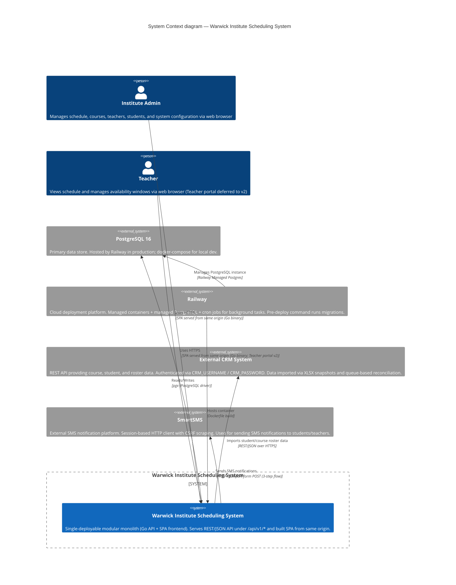

# C4 Level 1 — System Context

**Analysis Date:** Sat May 30 2026

## Key Findings

1. **System boundary is tight:** The Go monolith serves both API and SPA from a single binary (Dockerfile multi-stage build), keeping deployment to a single container. No separate frontend server or CDN in v1 — all traffic goes through one `:8080` entrypoint. The backend is *not* stateless: it holds session state server-side and has an in-process queue worker for CRM jobs.

2. **Two external integrations beyond the DB:** The CRM system (`CRM_BASE_URL`) is polled/imported via XLSX snapshots + queue-based reconciliation — not a live sync. SmartSMS is a separate notification channel with a screen-scraping HTTP client (Laravel session + CSRF). Both are optional (no-env fallback to empty string).

3. **Deployment is Railway-native:** Managed PostgreSQL via Railway add-on, cron jobs for background tasks (cleanup-idempotency, CRM import triggers), pre-deploy command runs `./migrate up`. No custom domain in v1 (`*.up.railway.app`). The `docker-compose.yml` only provides local-postgres for dev — no full local stack.

## Key Source Files (file:line)

| File | Line(s) | What it informed |
|------|---------|------------------|
| `CONTEXT.md` | 29–32 | Backend arch (modular monolith), PostgreSQL, Railway deploy target |
| `CONTEXT.md` | 39 | Frontend served from Go binary (same origin) |
| `CONTEXT.md` | 33–34 | Migrations run via Railway Pre-Deploy, cron jobs for bg work |
| `Dockerfile` | 11–18 | Multi-stage Go build produces server + migrate + cleanup binaries |
| `Dockerfile` | 3–9 | SPA built via node and baked into same image |
| `docker-compose.yml` | 2–9 | PostgreSQL 16 for local dev |
| `backend/cmd/server/main.go` | 53–77 | CRM import services, queue worker initialization |
| `backend/cmd/server/main.go` | 85–92 | Single HTTP server serving API + SPA |
| `backend/cmd/server/main.go` | 40–51 | Dev admin seeding (optional) |
| `backend/internal/config/config.go` | 8–23 | Config struct: CRM, SMS, DB, auth, timezone |
| `backend/internal/config/config.go` | 27–38 | CRM_BASE_URL, CRM_USERNAME, CRM_PASSWORD, SMS env vars |
| `.env.example` | 1–8 | Local dev env: DATABASE_URL, AUTH_PEPPER, optional admin seed |
| `backend/README.md` | 31–40 | Railway deploy settings: start cmd, pre-deploy, healthcheck, env |
| `backend/internal/smartsms/client.go` | 48–55 | SmartSMS HTTP client — session-based, 3-step SMS send flow |
| `backend/internal/crmimport/` | (entire package) | CRM data import via snapshot + queue + reconciliation |
