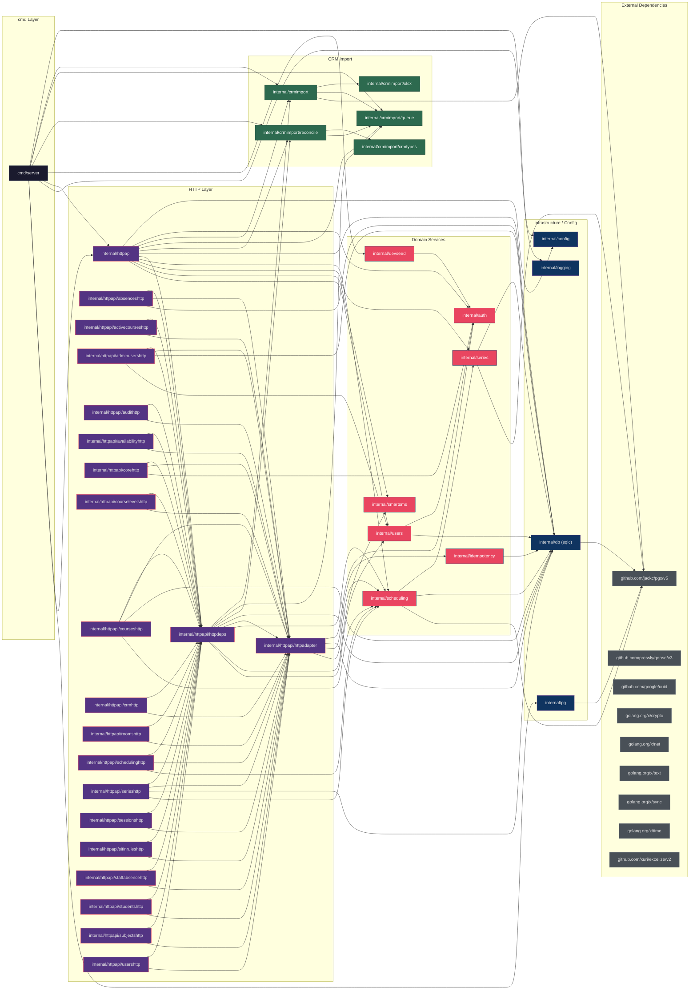

# Go Package Dependency Graph

**Analysis Date:** 2026-05-30

## Mermaid Graph

## Key Findings

### 1. Layering is clean top-to-bottom with one notable inversion
`cmd/server` → `httpapi` → domain services → `db` → pgx is the dominant flow. **Exception:** `users` package imports `auth` (`internal/users/password_hasher_auth.go:3`), which inverts the typical domain layering — `auth` should arguably depend on `users`, not the reverse. The `users.AdminProvisioningService` uses `auth.HashPassword` as a hashing utility, creating a coupling that would block extracting `users` as an independent module.

### 2. `scheduling` → `series` dependency respects the module boundary defined in CONTEXT.md
`scheduling` imports `series` as a dependency (via an interface `SeriesService` at `internal/scheduling/service.go:29`), but `series` never imports `scheduling`. This matches the documented contract: "scheduling owns all scheduling writes; series is an implementation detail behind scheduling" and is the **only** cross-module dependency between domain services outside the CRM subtree.

### 3. `crmimport` subtree is self-contained with sibling subpackage coupling
`crmimport` root imports `xlsx`; `reconcile` imports `crmtypes` + `queue`; `upload_v2` imports `queue` + `xlsx`. No CRM subpackage depends on any domain service outside its own subtree. However, `queue` and `reconcile` share a two-way awareness (reconcile imports queue types; queue does not import reconcile). The `crmimport` package is the only domain service directly constructed in `cmd/server` (not wired through `httpapi`), confirming its standalone-worker architecture.

### Key Source Files with Line Numbers

| File | Line | Purpose |
|------|------|---------|
| `internal/httpapi/handler.go` | 43–75 | Dependency injection: constructs `authSvc`, `seriesSvc`, `schedulingSvc`, `deps` struct |
| `internal/httpapi/handler.go` | 91–108 | Route registration: 18 `Register(mux, deps)` calls |
| `internal/httpapi/httpdeps/deps.go` | 21–35 | `Deps` struct — all injected dependencies in one type |
| `internal/httpapi/httpadapter/adapter.go` | 22–25 | HTTP adapter imports: auth, db, idempotency, scheduling |
| `internal/scheduling/service.go` | 17–18, 29 | Imports `series` via `SeriesService` interface |
| `internal/scheduling/service.go` | 59 | `scheduling.NewService(db, tz, seriesSvc)` — series injected |
| `internal/series/service.go` | 15 | Only internal dep is `db` |
| `internal/users/password_hasher_auth.go` | 3 | `users` → `auth` import inversion |
| `internal/users/store_sqlc.go` | 10 | `users` → `db` |
| `internal/crmimport/reconcile/reconcile.go` | 14–15 | `reconcile` imports `crmtypes` + `queue` |
| `internal/idempotency/idempotency.go` | 18 | `idempotency` imports `db` |
| `internal/devseed/admin.go` | 11 | `devseed` imports `auth` |
| `cmd/server/main.go` | 54–83 | CRM service construction + worker wiring |
| `cmd/server/main.go` | 87 | `httpapi.NewHandler(log, cfg, dbpool, uploadV2, reconcileV2, worker)` |
