# Database ER Diagram

**Analysis Date:** Sat May 30 2026

## Entity Relationship Diagram

```mermaid
erDiagram
    %% ==================== CORE ====================
    app_settings {
        boolean id PK "singleton=true"
        text institute_tz "default 'Asia/Bangkok'"
        jsonb absence_policies
        timestamptz created_at
        timestamptz updated_at
    }

    users {
        uuid id PK "gen_random_uuid()"
        text username UK
        text role "Admin or Teacher"
        text password_hash
        integer password_version "default 1"
        timestamptz deleted_at
        timestamptz created_at
        timestamptz updated_at
    }

    auth_sessions {
        uuid id PK
        uuid user_id FK
        timestamptz created_at
        timestamptz last_seen_at
        timestamptz expires_at
        timestamptz revoked_at
        integer password_version
    }

    audit_log {
        bigint id PK "bigserial"
        timestamptz created_at
        uuid actor_user_id FK "nullable"
        text action
        jsonb payload
    }

    %% =================== ROOMS / STUDENTS / SUBJECTS ====================
    rooms {
        uuid id PK "gen_random_uuid()"
        text name UK
        integer capacity ">0, nullable"
        timestamptz created_at
        timestamptz updated_at
    }

    students {
        uuid id PK "gen_random_uuid()"
        text wcode UK
        text full_name
        text notes "default ''"
        timestamptz created_at
        timestamptz updated_at
    }

    subjects {
        uuid id PK "gen_random_uuid()"
        text code UK
        text name
        timestamptz deleted_at
        timestamptz created_at
        timestamptz updated_at
    }

    %% =================== COURSES ====================
    courses {
        uuid id PK "gen_random_uuid()"
        text code UK
        text name
        bigint course_no UK "auto-seq"
        smallint year "nullable"
        uuid teacher_id FK "nullable"
        uuid subject_id FK "nullable"
        integer hour "nullable"
        integer student_count "nullable"
        text course_type "Private or Group, nullable"
        text cycle_id FK "nullable"
        smallint level "nullable"
        uuid root_course_group_id FK "nullable"
        timestamptz deleted_at
        timestamptz created_at
        timestamptz updated_at
        boolean crm_filter_enabled
        jsonb crm_filter
        timestamptz crm_filter_updated_at
        boolean crm_roster_locked
        integer crm_filter_version
        uuid crm_last_applied_snapshot_id FK "nullable"
        uuid crm_pending_review_snapshot_id FK "nullable"
        uuid crm_pinned_snapshot_id FK "nullable"
        jsonb crm_pending_review_summary
    }

    course_students {
        uuid course_id PK, FK
        uuid student_id PK, FK
        text status "enrolled or draft"
        timestamptz created_at
    }

    course_roster_overrides {
        uuid id PK
        uuid course_id FK
        uuid student_id FK
        enum action "include or exclude"
        uuid created_by_user_id FK
        timestamptz created_at
        uuid updated_by_user_id FK "nullable"
        timestamptz updated_at "nullable"
        timestamptz deleted_at "nullable"
    }

    subject_active_courses {
        uuid subject_id PK, FK "ON DELETE CASCADE"
        uuid course_id FK "ON DELETE CASCADE"
        timestamptz created_at
        timestamptz updated_at
    }

    %% =================== AVAILABILITY ====================
    teacher_availability {
        uuid id PK "gen_random_uuid()"
        uuid teacher_id FK
        timestamptz start_at
        timestamptz end_at
        tstzrange time_range "generated: [)"
        timestamptz deleted_at
        timestamptz created_at
        timestamptz updated_at
    }

    room_availability {
        uuid id PK "gen_random_uuid()"
        uuid room_id FK
        timestamptz start_at
        timestamptz end_at
        tstzrange time_range "generated: [)"
        timestamptz deleted_at
        timestamptz created_at
        timestamptz updated_at
    }

    %% =================== SCHEDULING ====================
    session_series {
        uuid id PK "gen_random_uuid()"
        uuid course_id FK
        uuid room_id FK "nullable"
        uuid teacher_id FK
        text institute_tz
        smallint[] weekdays "1-7 elements, 0-6"
        time start_local_time
        integer duration_minutes ">0"
        date start_date
        date end_date "nullable"
        integer count ">0, nullable"
        integer version ">0"
        timestamptz deleted_at
        timestamptz created_at
        timestamptz updated_at
    }

    sessions {
        uuid id PK "gen_random_uuid()"
        uuid series_id FK "nullable"
        uuid course_id FK
        uuid room_id FK "nullable"
        uuid teacher_id FK
        timestamptz start_at
        timestamptz end_at
        tstzrange time_range "generated: [)"
        integer version ">0"
        timestamptz deleted_at
        timestamptz created_at
        timestamptz updated_at
    }

    session_attendance {
        uuid session_id PK, FK
        uuid student_id PK, FK
        text status "included or excluded"
        timestamptz created_at
    }

    student_busy_ranges {
        uuid id PK "gen_random_uuid()"
        uuid student_id FK
        uuid session_id FK
        timestamptz start_at
        timestamptz end_at
        tstzrange time_range "generated: [)"
        timestamptz deleted_at
        timestamptz created_at
    }

    %% =================== IDEMPOTENCY ====================
    idempotency_keys {
        bigint id PK "bigserial"
        uuid actor_user_id "sentinel for system"
        text scope
        text idempotency_key
        text request_hash
        integer status_code "nullable"
        jsonb response_body "nullable"
        timestamptz created_at
        timestamptz expires_at
    }

    %% =================== CRM ====================
    crm_cycles {
        text id PK
        text label
        timestamptz last_imported_at "nullable"
        timestamptz created_at
        timestamptz updated_at
    }

    crm_snapshots {
        uuid id PK "gen_random_uuid()"
        timestamptz created_at
        text status "importing, ready, failed"
        integer row_count
        text error_msg "nullable"
    }

    crm_rows {
        uuid snapshot_id PK, FK
        integer xlsx_row_number PK
        text row_hash
        text cycle_label
        text course_name
        text wcode
        text first_name "nullable"
        text last_name "nullable"
        text nickname "nullable"
        text secondary_school "nullable"
        text academic_level "nullable"
        text mobile_phone "nullable"
        integer hours "nullable"
        text teachers_raw "nullable"
        text primary_email "nullable"
        text parent_name "nullable"
        text parent_phone "nullable"
        text parent_email "nullable"
        timestamptz order_quote_updated_at "nullable"
        timestamptz imported_at
    }

    crm_jobs {
        uuid id PK "gen_random_uuid()"
        enum job_type "import_snapshot, student_sync, course_reconcile_apply, course_reconcile_diff"
        enum status "queued, running, retry, succeeded, failed"
        jsonb payload
        text unique_key "nullable"
        jsonb result "nullable"
        text locked_by "nullable"
        timestamptz locked_until "nullable"
        timestamptz heartbeat_at "nullable"
        integer attempt
        integer max_attempts "default 3"
        timestamptz run_after
        text last_error "nullable"
        timestamptz created_at
        timestamptz updated_at
    }

    crm_pending_diffs {
        uuid course_id PK, FK
        uuid snapshot_id PK, FK
        enum diff_action PK "add or remove"
        integer seq PK
        uuid student_id FK "nullable"
        text wcode
        text full_name
    }

    crm_state {
        boolean singleton PK "CHECK=true"
        uuid active_snapshot_id FK "nullable"
        timestamptz created_at
        timestamptz updated_at
    }

    crm_upload_blobs {
        text id PK
        bytea data
        timestamptz created_at
    }

    %% =================== ABSENCES ====================
    student_absences {
        uuid id PK "gen_random_uuid()"
        text wcode
        uuid course_id FK
        date date_from
        date date_to
        text reason "nullable"
        text sit_in_method "physical or zoom, nullable"
        uuid sit_in_course_id FK "nullable"
        uuid subject_id FK "nullable"
        text status "pending, reviewed, actioned, cancelled"
        text reason_category "nullable"
        text admin_notes "nullable"
        text student_name "nullable"
        text student_email "nullable"
        text student_phone "nullable"
        uuid reviewed_by FK "nullable"
        timestamptz reviewed_at "nullable"
        boolean sit_in_overridden
        uuid sit_in_overridden_by FK "nullable"
        text sit_in_override_reason "nullable"
        integer version ">0"
        timestamptz created_at
        timestamptz updated_at
    }

    absence_sit_ins {
        uuid id PK "gen_random_uuid()"
        uuid absence_id FK "ON DELETE CASCADE"
        uuid session_id FK
        timestamptz created_at
    }

    absence_audit_log {
        uuid id PK "gen_random_uuid()"
        uuid absence_id FK "ON DELETE CASCADE"
        text action "append-only trigger"
        uuid actor_id FK "nullable"
        text actor_role "admin or student"
        jsonb details
        timestamptz created_at
    }

    %% =================== ROOT COURSE GROUPS / SIT-IN RULES ====================
    root_course_groups {
        uuid id PK "gen_random_uuid()"
        text name
        uuid sit_in_rule_id FK "nullable"
        timestamptz created_at
        timestamptz updated_at
    }

    sit_in_rules {
        uuid id PK "gen_random_uuid()"
        text name UK
        text type "level_ladder | cross_section | any_day_except_last | rank_chain | teacher_case_by_case"
        jsonb predicate
        text description "nullable"
        timestamptz created_at
        timestamptz updated_at
    }

    %% =================== RELATIONSHIPS ===================

    %% Auth
    users                ||--o{ auth_sessions : ""
    users                ||--o{ audit_log : "actor"

    %% Courses
    users                ||--o{ courses : "teacher"
    subjects             ||--o{ courses : ""
    courses              ||--o{ course_students : ""
    students             ||--o{ course_students : ""
    courses              ||--o{ course_roster_overrides : ""
    course_roster_overrides ||--|| students : ""
    users                ||--o{ course_roster_overrides : "creator"
    subjects             ||--o{ subject_active_courses : ""
    courses              ||--o{ subject_active_courses : ""
    crm_cycles           ||--o{ courses : ""
    root_course_groups   ||--o{ courses : ""

    %% Availability
    users                ||--o{ teacher_availability : ""
    rooms                ||--o{ room_availability : ""

    %% Scheduling
    courses              ||--o{ session_series : ""
    rooms                ||--o{ session_series : ""
    users                ||--o{ session_series : "teacher"
    session_series       ||--o{ sessions : "series → occurrences"
    courses              ||--o{ sessions : ""
    rooms                ||--o{ sessions : ""
    users                ||--o{ sessions : "teacher"
    sessions             ||--o{ session_attendance : ""
    students             ||--o{ session_attendance : ""
    sessions             ||--o{ student_busy_ranges : ""
    students             ||--o{ student_busy_ranges : ""
    course_students      ||--o{ student_busy_ranges : "derived via trigger"

    %% Idempotency
    users                ||--o{ idempotency_keys : "actor (or sentinel)"

    %% CRM
    crm_snapshots         ||--o{ crm_rows : ""
    crm_snapshots         ||--o{ crm_pending_diffs : ""
    crm_snapshots         ||--o{ crm_state : "active"
    courses               ||--o{ crm_pending_diffs : ""
    students              ||--o{ crm_pending_diffs : "nullable"
    courses               ||--o{ crm_snapshots : "last_applied|pending_review|pinned"

    %% Absences
    courses               ||--o{ student_absences : "course & sit_in_course"
    subjects              ||--o{ student_absences : ""
    student_absences      ||--o{ absence_sit_ins : "ON DELETE CASCADE"
    sessions              ||--o{ absence_sit_ins : ""
    student_absences      ||--o{ absence_audit_log : "ON DELETE CASCADE"
    users                 ||--o{ absence_audit_log : "actor"
    users                 ||--o{ student_absences : "reviewer"

    %% Sit-in rules
    sit_in_rules          ||--o{ root_course_groups : ""
```



---

## Key Findings

### 1. Series/Sessions Materialized-Occurrence Model with Versioned Optimistic Concurrency

The scheduling core uses a **parent-series + materialized-occurrence** pattern (`session_series` → `sessions`). Series hold recurrence rules (`weekdays[]`, `start_local_time`, `duration_minutes`, `start_date`, `end_date`/`count`) while each `sessions` row is a concrete time-anchored occurrence. Both tables carry a `version integer NOT NULL DEFAULT 1 CHECK (version > 0)` incremented on every write. All mutation queries gate on `WHERE id = $1 AND version = $2` and bump to `version + 1`, providing optimistic concurrency without lock tables. Room was also made nullable in `00006_room_nullable_version.sql` to support "Provisional" scheduling semantics where no room is assigned.

### 2. GiST Exclusion Constraints as DB-Level Final Gate for Overlap Enforcement

Three critical overlap constraints are enforced as PostgreSQL GiST exclusion constraints, not just application logic:
- **`sessions_no_room_overlap`** — `EXCLUDE USING gist (room_id WITH =, time_range WITH &&) WHERE (deleted_at IS NULL)` — blocks room double-booking.
- **`sessions_no_teacher_overlap`** — same pattern for teacher exclusivity.
- **`student_busy_ranges_no_overlap`** — `EXCLUDE USING gist (student_id WITH =, time_range WITH &&) WHERE (deleted_at IS NULL)` — blocks student overlap.

These use `btree_gist` extension (loaded in migration `00001`). All three are soft-delete aware via `WHERE (deleted_at IS NULL)`. The `time_range` is a **generated** `tstzrange` column (`tstzrange(start_at, end_at, '[)')`) maintained automatically by PostgreSQL.

### 3. Trigger-Driven Derived State: Student Busy Ranges from Course Roster + Attendance Overrides

`student_busy_ranges` is **not** manually written — it is maintained entirely by triggers (`00004_triggers.sql`, refined in `00008_course_students_incremental_busy.sql`). The trigger function `refresh_student_busy_ranges_for_session()` computes the effective roster per session as:
```
(course_students base roster UNION explicit includes from session_attendance)
EXCEPT explicit excludes from session_attendance
```
Triggers fire on `sessions` (INSERT/UPDATE of course/time/deleted), `session_attendance` (INSERT/UPDATE/DELETE), and `course_students` (INSERT/DELETE). Migration `00008` replaced an O(N×R) full-refresh trigger with an incremental per-student bulk operation, addressing a SEV-1 scaling incident. The `absence_audit_log` table is similarly protected by an append-only trigger that rejects UPDATE/DELETE.

### 4. Notable Schema Design Decisions

- **Singleton pattern**: `app_settings` and `crm_state` use `boolean PRIMARY KEY DEFAULT true CHECK (singleton = true)` to enforce single-row tables.
- **Soft delete everywhere**: `deleted_at timestamptz NULL` is used on `users`, `courses`, `subjects`, `session_series`, `sessions`, `student_busy_ranges`, `teacher_availability`, `room_availability`, and `course_roster_overrides`. Soft-deleted sessions are excluded from overlap enforcement.
- **Idempotency key system**: `idempotency_keys` table with a unique index on `(actor_user_id, scope, idempotency_key)` provides safe retry for all side-effecting endpoints. The `actor_user_id` is NOT NULL (sentinel `00000000-...` for system jobs) to avoid PostgreSQL NULLs-in-unique-index pitfalls.
- **Course → subject relationship**: Courses reference both `subject_id` and `cycle_id` (from CRM), with a unique index on `(subject_id, cycle_id, level)` enabling per-subject/cycle/level ordering.
- **Absence management evolution**: `student_absences` grew from a minimal record (wcode, course, dates, reason) into a full managed workflow with status machine (`pending→reviewed→actioned|cancelled`), audit log, sit-in session linking, versioned optimistic locking, and admin review fields — all added incrementally across migrations `00014` through `00021`.

## Key Source Files

| Table | Definition | Line |
|-------|-----------|------|
| `app_settings` | `backend/db/migrations/00001_init.sql` | 5-11 |
| `users` | `backend/db/migrations/00001_init.sql` | 16-25 |
| `auth_sessions` | `backend/db/migrations/00001_init.sql` | 27-36 |
| `audit_log` | `backend/db/migrations/00001_init.sql` | 41-47 |
| `rooms` | `backend/db/migrations/00002_core_tables.sql` | 3-9 |
| `students` | `backend/db/migrations/00002_core_tables.sql` | 11-18 |
| `courses` | `backend/db/migrations/00002_core_tables.sql` | 20-27 |
| `course_students` | `backend/db/migrations/00002_core_tables.sql` | 29-34 |
| `subjects` | `backend/db/migrations/00007_subjects_and_course_fields.sql` | 4-11 |
| `teacher_availability` | `backend/db/migrations/00003_scheduling.sql` | 4-13 |
| `room_availability` | `backend/db/migrations/00003_scheduling.sql` | 19-28 |
| `session_series` | `backend/db/migrations/00003_scheduling.sql` | 35-51 |
| `sessions` | `backend/db/migrations/00003_scheduling.sql` | 54-66 |
| `session_attendance` | `backend/db/migrations/00003_scheduling.sql` | 73-79 |
| `student_busy_ranges` | `backend/db/migrations/00003_scheduling.sql` | 82-91 |
| GiST exclusion constraints | `backend/db/migrations/00003_scheduling.sql` | 98-111 |
| Room nullable + version | `backend/db/migrations/00006_room_nullable_version.sql` | 1-56 |
| `idempotency_keys` | `backend/db/migrations/00009_idempotency_keys.sql` | 10-25 |
| `course_roster_overrides` | `backend/db/migrations/00012_crm_hardened_v2.sql` | 116-132 |
| `crm_cycles` | `backend/db/migrations/00011_crm_import.sql` | 5-11 |
| `crm_rows` | `backend/db/migrations/00011_crm_import.sql` + `00012` | 14-38 / 28-43 |
| `crm_snapshots` | `backend/db/migrations/00012_crm_hardened_v2.sql` | 6-13 |
| `crm_jobs` | `backend/db/migrations/00012_crm_hardened_v2.sql` | 63-91 |
| `crm_pending_diffs` | `backend/db/migrations/00012_crm_hardened_v2.sql` | 143-154 |
| `crm_state` | `backend/db/migrations/00012_crm_hardened_v2.sql` | 179-184 |
| `crm_upload_blobs` | `backend/db/migrations/00012_crm_hardened_v2.sql` | 194-198 |
| `student_absences` | `backend/db/migrations/00014_student_absences.sql` + `00021` | 3-12 / 3-17 |
| `absence_sit_ins` | `backend/db/migrations/00016_absence_extensions.sql` | 7-13 |
| `absence_audit_log` | `backend/db/migrations/00021_absence_management.sql` | 24-34 |
| `root_course_groups` | `backend/db/migrations/00019_courses_root_course.sql` | 2-7 |
| `sit_in_rules` | `backend/db/migrations/00023_sit_in_rules.sql` | 3-11 |
| `subject_active_courses` | `backend/db/migrations/00022_subject_active_courses.sql` | 3-9 |
| `Course` model (struct) | `backend/internal/db/models.go` | 212-235 |
| `SessionSeries` model | `backend/internal/db/models.go` | 390-406 |
| `Session` model | `backend/internal/db/models.go` | 368-381 |
| `StudentBusyRange` model | `backend/internal/db/models.go` | 428-437 |
| `IdempotencyKey` model | `backend/internal/db/models.go` | 337-347 |
| `SitInRule` model (custom) | `backend/internal/db/sit_in_rules_custom.go` | 9-17 |

---

*ERD generated from migration DDL + sqlc models: Sat May 30 2026*
