# Warwick Institute Scheduling System — 20 Perspective Diagrams

> Generated 2026-05-30 by 20 GSD sub-agents analyzing codebase from separate perspectives.

---

## Part 1: Architecture Layer

---

### Diagram 1: System Context (C4 L1)

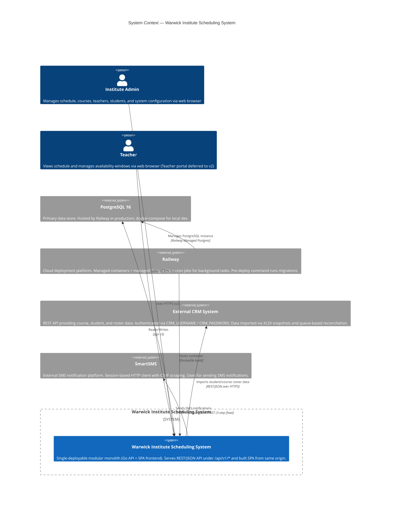
```mermaid
C4Context
  title System Context — Warwick Institute Scheduling System

  Person(admin, "Institute Admin", "Manages schedule, courses, teachers, students, and system configuration via web browser")
  Person(teacher, "Teacher", "Views schedule and manages availability windows via web browser (Teacher portal deferred to v2)")

  System_Boundary(warwick_system, "Warwick Institute Scheduling System") {
    System(scheduling_system, "Warwick Institute Scheduling System", "Single-deployable modular monolith (Go API + SPA frontend). Serves REST/JSON API under /api/v1/* and built SPA from same origin.")
  }

  System_Ext(pg, "PostgreSQL 16", "Primary data store. Hosted by Railway in production; docker-compose for local dev.")
  System_Ext(railway, "Railway", "Cloud deployment platform. Managed containers + managed PostgreSQL + cron jobs for background tasks. Pre-deploy command runs migrations.")
  System_Ext(crm, "External CRM System", "REST API providing course, student, and roster data. Authenticated via CRM_USERNAME / CRM_PASSWORD. Data imported via XLSX snapshots and queue-based reconciliation.")
  System_Ext(smartsms, "SmartSMS", "External SMS notification platform. Session-based HTTP client with CSRF scraping. Used for sending SMS notifications.")

  Rel(admin, scheduling_system, "Uses HTTPS")
  Rel(teacher, scheduling_system, "Uses HTTPS (v2)")

  Rel(scheduling_system, pg, "Reads/Writes", "pgx v5")
  Rel(scheduling_system, crm, "Imports student/course roster data", "REST/JSON over HTTPS")
  Rel(scheduling_system, smartsms, "Sends SMS notifications", "HTTP multipart form POST (3-step flow)")

  Rel(railway, scheduling_system, "Hosts container", "Dockerfile build")
  Rel(railway, pg, "Manages PostgreSQL instance", "Railway Managed Postgres")

  UpdateLayoutConfig($c4ShapeInRow="3", $c4BoundaryInRow="1")
```

**Findings:** System boundary is tight — Go monolith serves API + SPA same origin. Two external integrations (CRM via XLSX snapshots, SmartSMS via screen-scraping HTTP client). Railway-native deployment (managed PG, cron, pre-deploy migrations).

**Key files:** `CONTEXT.md:29-39`, `Dockerfile:3-18`, `docker-compose.yml:2-9`, `cmd/server/main.go:53-92`

---

### Diagram 2: Backend Go Module Graph

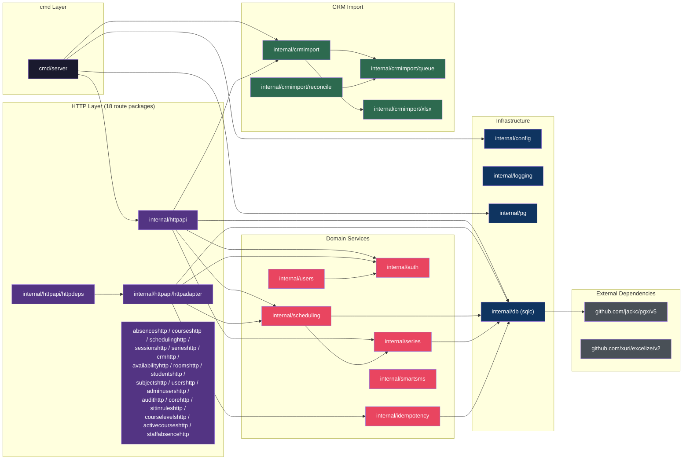
```mermaid
flowchart LR
  subgraph external["External Dependencies"]
    pgx["github.com/jackc/pgx/v5"]
    excelize["github.com/xuri/excelize/v2"]
  end

  subgraph cmd["cmd Layer"]
    main["cmd/server"]
  end

  subgraph infra["Infrastructure"]
    config["internal/config"]
    logging["internal/logging"]
    pg["internal/pg"]
    db["internal/db (sqlc)"]
  end

  subgraph http["HTTP Layer (18 route packages)"]
    httpapi["internal/httpapi"]
    httpdeps["internal/httpapi/httpdeps"]
    httpadapter["internal/httpapi/httpadapter"]
    routes["absenceshttp / courseshttp / schedulinghttp /<br/>sessionshttp / serieshttp / crmhttp /<br/>availabilityhttp / roomshttp / studentshttp /<br/>subjectshttp / usershttp / adminusershttp /<br/>audithttp / corehttp / sitinruleshttp /<br/>courselevelshttp / activecourseshttp / staffabsencehttp"]
  end

  subgraph domain["Domain Services"]
    auth["internal/auth"]
    scheduling["internal/scheduling"]
    series["internal/series"]
    idempotency["internal/idempotency"]
    smartsms["internal/smartsms"]
    users["internal/users"]
  end

  subgraph crm["CRM Import"]
    crmimport["internal/crmimport"]
    crmqueue["internal/crmimport/queue"]
    crmreconcile["internal/crmimport/reconcile"]
    crmxlsx["internal/crmimport/xlsx"]
  end

  main --> config
  main --> httpapi
  main --> crmimport
  main --> pg

  db --> pgx
  httpapi --> auth & scheduling & series & db & crmimport
  httpdeps --> httpadapter
  httpadapter --> auth & db & idempotency & scheduling

  scheduling --> series
  scheduling --> db
  series --> db
  users --> auth
  idempotency --> db
  crmimport --> crmqueue & crmxlsx
  crmreconcile --> crmqueue

  classDef cmd fill:#1a1a2e,color:#fff
  classDef infra fill:#0f3460,color:#fff
  classDef http fill:#533483,color:#fff
  classDef domain fill:#e94560,color:#fff
  classDef crm fill:#2d6a4f,color:#fff
  classDef ext fill:#495057,color:#fff

  class main cmd
  class config,logging,pg,db infra
  class httpapi,httpdeps,httpadapter,routes http
  class auth,scheduling,series,idempotency,smartsms,users domain
  class crmimport,crmqueue,crmreconcile,crmxlsx crm
  class pgx,excelize ext
```

**Findings:** Clean top-to-bottom layering (`cmd → httpapi → domain → db`). One inversion: `users` imports `auth` (for `HashPassword` utility). `scheduling → series` is the only cross-module domain dependency (respects documented boundary). CRM subtree is self-contained.

**Key files:** `internal/httpapi/handler.go:43-108`, `internal/scheduling/service.go:17-29`, `internal/users/password_hasher_auth.go:3`, `cmd/server/main.go:54-87`

---

### Diagram 3: Frontend Page Tree

```mermaid
flowchart TB
  subgraph Entry
    main_tsx["main.tsx → App"]
  end

  subgraph Providers
    TP["<ToastProvider>"]
    AP["<AuthProvider>"]
    RA["<RequireAuth>"]
    AL["<AppLayout> (nav + Outlet)"]
  end

  subgraph Public["Public Routes"]
    LOGIN["/login → Login.tsx"]
    ABSENCE_FORM["/absence → AbsenceForm.tsx"]
  end

  subgraph SCHEDULING["Scheduling"]
    HOME["/ → Home.tsx"]
    SCHEDULE["/schedule → Schedule.tsx<br/>PreflightIndicator, SessionOccurrenceForm, SeriesFormFields,<br/>TypeaheadSelect, Modal, AttendancePanel"]
    AVAIL["/availability → Availability.tsx"]
    SLOT["/slot-finder → SlotFinder.tsx"]
  end

  subgraph COURSES["Courses"]
    COURSES["/courses → Courses.tsx"]
    COURSE_CREATE["/courses/create → CourseCreate.tsx"]
    COURSE_DETAIL["/courses/:id → CourseDetail.tsx<br/>PreflightIndicator, AttendeeSection, ScheduleSessionCard"]
    COURSE_EDIT["/courses/:id/edit → CourseEdit.tsx"]
    COURSE_LEVELS["/course-levels → CourseLevels.tsx<br/>LevelLadderCanvas, RootCourseGroupRail,<br/>RuleSelector, RulePredicateForm, AutoSitInToggle"]
  end

  subgraph STUDENTS["Students"]
    STUDENTS["/students → Students.tsx"]
    STUDENT_PROFILE["/students/:wcode → StudentProfile.tsx"]
  end

  subgraph TEACHERS["Teachers"]
    TEACHERS["/teachers → Teachers.tsx"]
    TEACHER_CREATE["/teachers/create → TeacherCreate.tsx"]
    TEACHER_PROFILE["/teachers/:id → TeacherProfile.tsx"]
  end

  subgraph ADMIN["Admin / Operations"]
    OP_HUB["/admin/operations → OperationsHub.tsx<br/>SitInRulesSection, ActiveCoursesSection,<br/>StaffAbsenceRulesSection, FormSettingsSection"]
    USERS["/users → Users.tsx"]
    CRM["/crm → CrmAdmin.tsx"]
    CLASSROOMS["/classrooms → Classrooms.tsx"]
  end

  subgraph ABSENCES["Absences"]
    ABSENCES["/absences → Absences.tsx"]
    ABS_DASH["/absences/dashboard → AbsenceDashboard.tsx"]
    ABS_DETAIL["/absences/:id → AbsenceDetail.tsx"]
    OPS_CAL["/absences/calendar → OperationsCalendar.tsx"]
  end

  subgraph SHARED["Shared Components (35+)"]
    SHARED_LIST["Modal, ConfirmModal, SlideOver,<br/>TypeaheadSelect, PreflightIndicator,<br/>ProvisionalBadge, StaleEditBanner,<br/>ScheduleSessionCard, SessionActions,<br/>AttendancePanel, AttendeeSection,<br/>RuleSelector, LevelLadderCanvas, ..."]
  end

  main_tsx --> TP --> AP --> RA
  RA --> LOGIN & ABSENCE_FORM
  RA --> AL
  AL --> HOME & SCHEDULE & AVAIL & SLOT
  AL --> COURSES & COURSE_CREATE & COURSE_DETAIL & COURSE_EDIT & COURSE_LEVELS
  AL --> STUDENTS & STUDENT_PROFILE
  AL --> TEACHERS & TEACHER_CREATE & TEACHER_PROFILE
  AL --> OP_HUB & USERS & CRM & CLASSROOMS
  AL --> ABSENCES & ABS_DASH & ABS_DETAIL & OPS_CAL
```

**Findings:** Two public routes (login, absence form); all others behind `RequireAuth`. Pages are heavy (Schedule.tsx 1040 lines, CourseDetail.tsx 1145, CourseLevels.tsx 1137). Cross-domain component reuse (PreflightIndicator, Modal, TypeaheadSelect used in both Scheduling and Courses). Course Levels has its own deep component tree with 6 dedicated hooks.

**Key files:** `src/App.tsx:1-99`, `src/pages/Schedule.tsx:1-1040`, `src/pages/CourseDetail.tsx:1-1145`, `src/pages/CourseLevels.tsx:1-1137`, `src/components/Layout.tsx:1-323`

---

### Diagram 4: API Route Map

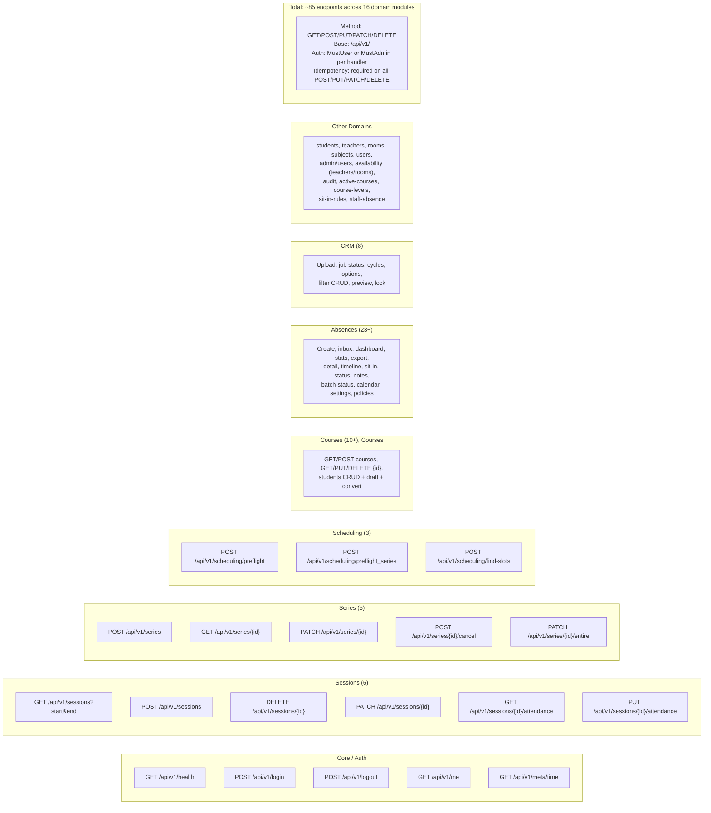
```mermaid
flowchart LR
  subgraph core["Core / Auth"]
    core1["GET /api/v1/health"]
    core2["POST /api/v1/login"]
    core3["POST /api/v1/logout"]
    core4["GET /api/v1/me"]
    core5["GET /api/v1/meta/time"]
  end

  subgraph sessions["Sessions (6)"]
    sess1["GET /api/v1/sessions?start&end"]
    sess2["POST /api/v1/sessions"]
    sess3["DELETE /api/v1/sessions/{id}"]
    sess4["PATCH /api/v1/sessions/{id}"]
    sess5["GET /api/v1/sessions/{id}/attendance"]
    sess6["PUT /api/v1/sessions/{id}/attendance"]
  end

  subgraph series["Series (5)"]
    ser1["POST /api/v1/series"]
    ser2["GET /api/v1/series/{id}"]
    ser3["PATCH /api/v1/series/{id}"]
    ser4["POST /api/v1/series/{id}/cancel"]
    ser5["PATCH /api/v1/series/{id}/entire"]
  end

  subgraph scheduling["Scheduling (3)"]
    sch1["POST /api/v1/scheduling/preflight"]
    sch2["POST /api/v1/scheduling/preflight_series"]
    sch3["POST /api/v1/scheduling/find-slots"]
  end

  subgraph courses["Courses (10+)", Courses]
    crs_routes["GET/POST courses, GET/PUT/DELETE {id},<br/>students CRUD + draft + convert"]
  end

  subgraph absences["Absences (23+)"]
    abs_routes["Create, inbox, dashboard, stats, export,<br/>detail, timeline, sit-in, status, notes,<br/>batch-status, calendar, settings, policies"]
  end

  subgraph crm["CRM (8)"]
    crm_routes["Upload, job status, cycles, options,<br/>filter CRUD, preview, lock"]
  end

  subgraph other["Other Domains"]
    other_list["students, teachers, rooms, subjects, users,<br/>admin/users, availability (teachers/rooms),<br/>audit, active-courses, course-levels,<br/>sit-in-rules, staff-absence"]
  end

  subgraph total["Total: ~85 endpoints across 16 domain modules"]
    total_note["Method: GET/POST/PUT/PATCH/DELETE<br/>Base: /api/v1/<br/>Auth: MustUser or MustAdmin per handler<br/>Idempotency: required on all POST/PUT/PATCH/DELETE"]
  end
```

**Findings:** 85 registered HTTP endpoints across 16 domain modules. Mixed URL conventions — admin routes use `/api/v1/admin/` prefix but some admin-gated routes don't. Strong RESTful patterns with some verb-in-URL exceptions (`/cancel`, `/reset_password`, `/preflight`). Two duplicate routes: `GET /operations/calendar` and `GET /absences/calendar` map to same handler.

**Key files:** `backend/internal/httpapi/handler.go:91-107`, `backend/internal/httpapi/sessionshttp/routes.go:44-50`, `backend/internal/httpapi/schedulinghttp/routes.go:23-25`, `backend/internal/httpapi/serieshttp/routes.go:72-76`

---

### Diagram 5: Database ERD

```mermaid
erDiagram
    users { uuid id PK text role "Admin|Teacher" integer password_version }
    auth_sessions { uuid id PK uuid user_id FK timestamptz expires_at timestamptz revoked_at }

    courses { uuid id PK text code UK uuid teacher_id FK uuid subject_id FK uuid root_course_group_id FK uuid cycle_id FK smallint level boolean crm_roster_locked }
    course_students { uuid course_id PK FK uuid student_id PK FK text status "enrolled|draft" }
    course_roster_overrides { uuid id PK uuid course_id FK uuid student_id FK text action "include|exclude" }
    students { uuid id PK text wcode UK text full_name text parent_phone }
    subjects { uuid id PK text code UK text name }

    rooms { uuid id PK text name UK integer capacity }
    teacher_availability { uuid id PK uuid teacher_id FK tstzrange time_range }
    room_availability { uuid id PK uuid room_id FK tstzrange time_range }

    session_series { uuid id PK uuid course_id FK uuid room_id FK "nullable" uuid teacher_id FK smallint[] weekdays time start_local_time int duration_minutes date start_date date end_date "nullable" int count "nullable" int version }
    sessions { uuid id PK uuid series_id FK "nullable" uuid course_id FK uuid room_id FK "nullable" uuid teacher_id FK timestamptz start_at timestamptz end_at tstzrange time_range int version timestamptz deleted_at }
    session_attendance { uuid session_id PK FK uuid student_id PK FK text status "included|excluded" }
    student_busy_ranges { uuid id PK uuid student_id FK uuid session_id FK tstzrange time_range }

    idempotency_keys { bigint id PK uuid actor_user_id text idempotency_key text request_hash int status_code jsonb response_body }
    audit_log { bigint id PK uuid actor_user_id text action jsonb payload }

    crm_snapshots { uuid id PK text status "importing|ready|failed" }
    crm_rows { uuid snapshot_id PK FK int xlsx_row_number PK text wcode text course_name text parent_phone }
    crm_jobs { uuid id PK text job_type text status jsonb payload int attempt int max_attempts }
    crm_pending_diffs { uuid course_id PK FK uuid snapshot_id PK FK text diff_action uuid student_id }

    student_absences { uuid id PK text wcode uuid course_id FK date date_from date_to text status "pending|reviewed|actioned|cancelled" int version }
    absence_sit_ins { uuid id PK uuid absence_id FK uuid session_id FK }
    absence_audit_log { uuid id PK uuid absence_id FK text action jsonb details "append-only" }

    root_course_groups { uuid id PK text name uuid sit_in_rule_id FK }
    sit_in_rules { uuid id PK text type "level_ladder|cross_section|any_day_except_last|rank_chain|teacher_case_by_case" jsonb predicate }

    users ||--o{ auth_sessions : ""
    users ||--o{ teacher_availability : ""
    users ||--o{ session_series : "teacher"
    users ||--o{ sessions : "teacher"
    courses ||--o{ session_series : ""
    courses ||--o{ sessions : ""
    courses ||--o{ course_students : ""
    course_students ||--|| students : ""
    session_series ||--o{ sessions : "series->occurrences"
    sessions ||--o{ session_attendance : ""
    sessions ||--o{ student_busy_ranges : ""
    rooms ||--o{ sessions : ""
    rooms ||--o{ room_availability : ""
    sit_in_rules ||--o{ root_course_groups : ""
    courses ||--o{ student_absences : ""
    student_absences ||--o{ absence_sit_ins : "CASCADE"
    student_absences ||--o{ absence_audit_log : "CASCADE"
```

**Findings:** Series/sessions materialized-occurrence model with versioned optimistic concurrency. 3 GiST exclusion constraints as DB-level final gate for overlap enforcement. Student busy ranges maintained entirely by triggers (refined in `00008` to fix SEV-1 scaling issue). Soft delete everywhere. Singleton pattern for `app_settings` and `crm_state`.

**Key files:** `db/migrations/00003_scheduling.sql:98-111` (exclusion constraints), `db/migrations/00004_triggers.sql:5-63` (busy range triggers), `db/models.go:368-406` (Session + SessionSeries structs)

---

## Part 2: Scheduling Domain

---

### Diagram 6: Session Create Flow

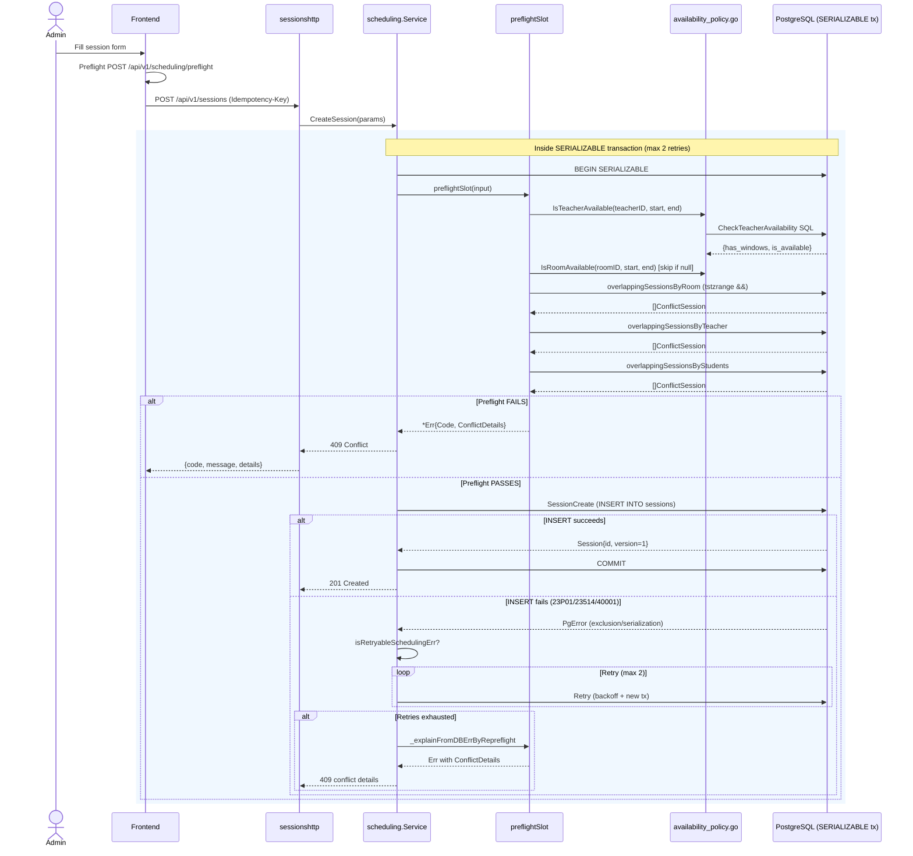
```mermaid
sequenceDiagram
    actor Admin
    participant FE as Frontend
    participant SessionsHTTP as sessionshttp
    participant SchedSvc as scheduling.Service
    participant Preflight as preflightSlot
    participant Avail as availability_policy.go
    participant DB as PostgreSQL (SERIALIZABLE tx)

    Admin->>FE: Fill session form
    FE->>FE: Preflight POST /api/v1/scheduling/preflight
    FE->>SessionsHTTP: POST /api/v1/sessions (Idempotency-Key)

    SessionsHTTP->>SchedSvc: CreateSession(params)

    rect rgb(240,248,255)
        Note over SchedSvc,DB: Inside SERIALIZABLE transaction (max 2 retries)
        SchedSvc->>DB: BEGIN SERIALIZABLE
        SchedSvc->>Preflight: preflightSlot(input)

        Preflight->>Avail: IsTeacherAvailable(teacherID, start, end)
        Avail->>DB: CheckTeacherAvailability SQL
        DB-->>Avail: {has_windows, is_available}

        Preflight->>Avail: IsRoomAvailable(roomID, start, end) [skip if null]
        Preflight->>DB: overlappingSessionsByRoom (tstzrange &&)
        DB-->>Preflight: []ConflictSession
        Preflight->>DB: overlappingSessionsByTeacher
        DB-->>Preflight: []ConflictSession
        Preflight->>DB: overlappingSessionsByStudents
        DB-->>Preflight: []ConflictSession

        alt Preflight FAILS
            Preflight-->>SchedSvc: *Err{Code, ConflictDetails}
            SchedSvc-->>SessionsHTTP: 409 Conflict
            SessionsHTTP-->>FE: {code, message, details}
        else Preflight PASSES
            SchedSvc->>DB: SessionCreate (INSERT INTO sessions)
            alt INSERT succeeds
                DB-->>SchedSvc: Session{id, version=1}
                SchedSvc->>DB: COMMIT
                SchedSvc-->>SessionsHTTP: 201 Created
            else INSERT fails (23P01/23514/40001)
                DB-->>SchedSvc: PgError (exclusion/serialization)
                SchedSvc->>SchedSvc: isRetryableSchedulingErr?
                loop Retry (max 2)
                    SchedSvc->>DB: Retry (backoff + new tx)
                end
                alt Retries exhausted
                    SchedSvc->>Preflight: _explainFromDBErrByRepreflight
                    Preflight-->>SchedSvc: Err with ConflictDetails
                    SchedSvc-->>SessionsHTTP: 409 conflict details
                end
            end
        end
    end
```

**Findings:** Preflight is advisory inside SERIALIZABLE tx but DB exclusion constraints are the final correctness gate. Structured error response is a first-class protocol concern (stable `Err` type with `Code` + `ConflictDetails`). Three-tier student overlap strategy: explicit IDs → empty (skip) → course roster fallback.

**Key files:** `scheduling/service.go:571-676` (CreateSessionTx), `scheduling/preflight.go:105-205` (preflightSlot), `scheduling/errors.go:1-59` (Err type), `sessionshttp/routes.go:140-247`

---

### Diagram 7: Session Edit/Cancel

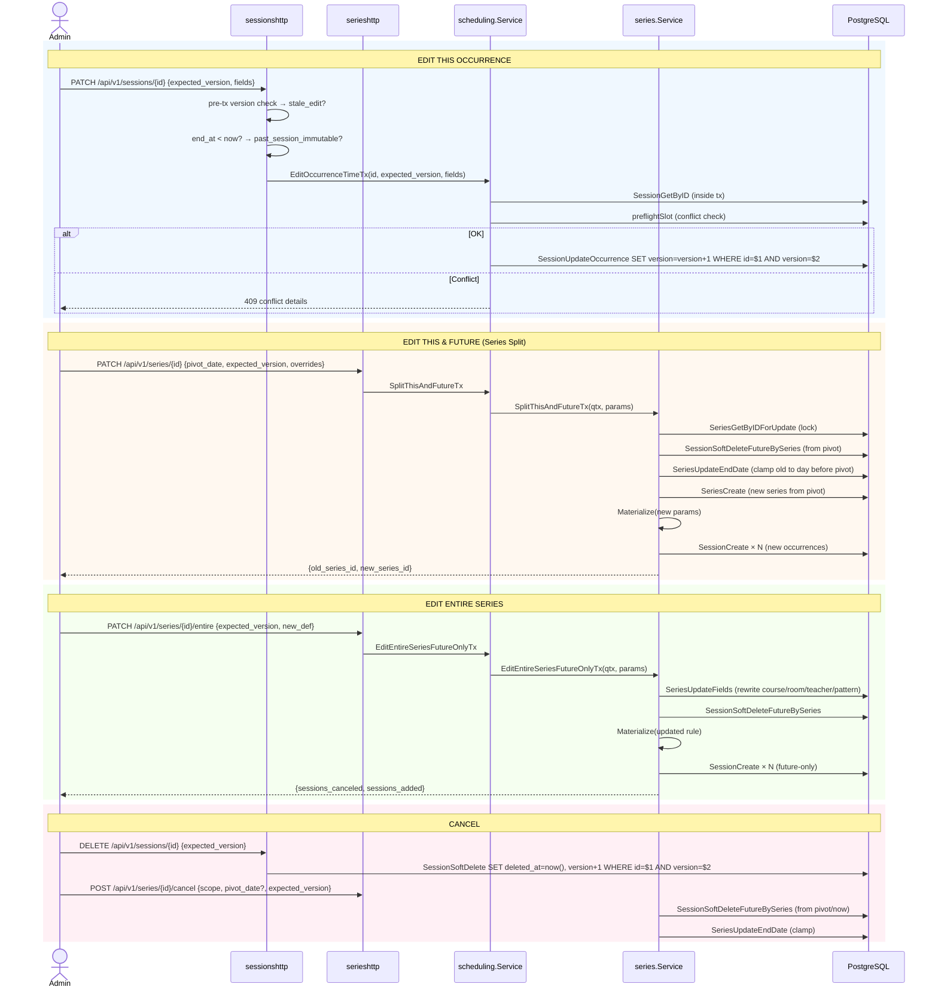
```mermaid
sequenceDiagram
    actor Admin
    participant SessionsHTTP as sessionshttp
    participant SeriesHTTP as serieshttp
    participant SchedSvc as scheduling.Service
    participant SeriesSvc as series.Service
    participant DB as PostgreSQL

    rect rgb(240,248,255)
        Note over Admin,DB: EDIT THIS OCCURRENCE
        Admin->>SessionsHTTP: PATCH /api/v1/sessions/{id} {expected_version, fields}
        SessionsHTTP->>SessionsHTTP: pre-tx version check → stale_edit?
        SessionsHTTP->>SessionsHTTP: end_at < now? → past_session_immutable?
        SessionsHTTP->>SchedSvc: EditOccurrenceTimeTx(id, expected_version, fields)
        SchedSvc->>DB: SessionGetByID (inside tx)
        SchedSvc->>DB: preflightSlot (conflict check)
        alt OK
            SchedSvc->>DB: SessionUpdateOccurrence SET version=version+1 WHERE id=$1 AND version=$2
        else Conflict
            SchedSvc-->>Admin: 409 conflict details
        end
    end

    rect rgb(255,248,240)
        Note over Admin,DB: EDIT THIS & FUTURE (Series Split)
        Admin->>SeriesHTTP: PATCH /api/v1/series/{id} {pivot_date, expected_version, overrides}
        SeriesHTTP->>SchedSvc: SplitThisAndFutureTx
        SchedSvc->>SeriesSvc: SplitThisAndFutureTx(qtx, params)
        SeriesSvc->>DB: SeriesGetByIDForUpdate (lock)
        SeriesSvc->>DB: SessionSoftDeleteFutureBySeries (from pivot)
        SeriesSvc->>DB: SeriesUpdateEndDate (clamp old to day before pivot)
        SeriesSvc->>DB: SeriesCreate (new series from pivot)
        SeriesSvc->>SeriesSvc: Materialize(new params)
        SeriesSvc->>DB: SessionCreate × N (new occurrences)
        SeriesSvc-->>Admin: {old_series_id, new_series_id}
    end

    rect rgb(245,255,240)
        Note over Admin,DB: EDIT ENTIRE SERIES
        Admin->>SeriesHTTP: PATCH /api/v1/series/{id}/entire {expected_version, new_def}
        SeriesHTTP->>SchedSvc: EditEntireSeriesFutureOnlyTx
        SchedSvc->>SeriesSvc: EditEntireSeriesFutureOnlyTx(qtx, params)
        SeriesSvc->>DB: SeriesUpdateFields (rewrite course/room/teacher/pattern)
        SeriesSvc->>DB: SessionSoftDeleteFutureBySeries
        SeriesSvc->>SeriesSvc: Materialize(updated rule)
        SeriesSvc->>DB: SessionCreate × N (future-only)
        SeriesSvc-->>Admin: {sessions_canceled, sessions_added}
    end

    rect rgb(255,240,245)
        Note over Admin,DB: CANCEL
        Admin->>SessionsHTTP: DELETE /api/v1/sessions/{id} {expected_version}
        SessionsHTTP->>DB: SessionSoftDelete SET deleted_at=now(), version+1 WHERE id=$1 AND version=$2
        Admin->>SeriesHTTP: POST /api/v1/series/{id}/cancel {scope, pivot_date?, expected_version}
        SeriesSvc->>DB: SessionSoftDeleteFutureBySeries (from pivot/now)
        SeriesSvc->>DB: SeriesUpdateEndDate (clamp)
    end
```

**Findings:** Series split creates a second record — old series not destroyed, clamped to before pivot. Past sessions immutable (two enforcement layers: HTTP check + SQL WHERE on soft-delete). Soft delete is universal cancellation mechanism (no hard deletes).

**Key files:** `sessionshttp/routes.go:320-497`, `series/service.go:203-378` (SplitThisAndFutureTx), `series/service.go:441-562` (EditEntireSeriesFutureOnlyTx), `series/materialize.go:36-110`, `db/sessions.sql.go:370-411`

---

### Diagram 8: Preflight Engine

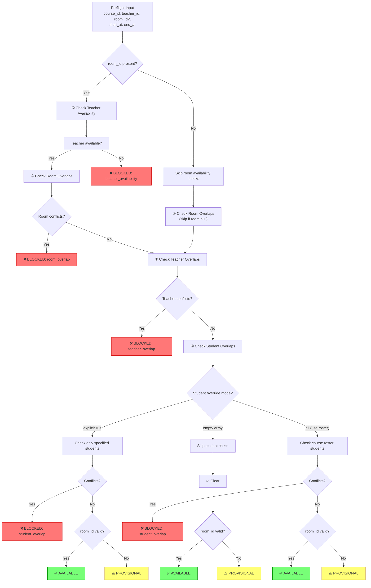
```mermaid
flowchart TD
    A["Preflight Input<br/>course_id, teacher_id, room_id?,<br/>start_at, end_at"] --> B{"room_id present?"}
    B -- No --> C["Skip room availability checks"]
    B -- Yes --> D["① Check Teacher Availability"]

    C --> E["② Check Room Overlaps<br/>(skip if room null)"]
    D --> F["Teacher available?"]
    F -- No --> G["❌ BLOCKED: teacher_availability"]
    F -- Yes --> H["③ Check Room Overlaps"]

    H --> I{"Room conflicts?"}
    I -- Yes --> J["❌ BLOCKED: room_overlap"]
    I -- No --> K["④ Check Teacher Overlaps"]

    E --> K
    K --> L{"Teacher conflicts?"}
    L -- Yes --> M["❌ BLOCKED: teacher_overlap"]
    L -- No --> N["⑤ Check Student Overlaps"]

    N --> O{"Student override mode?"}
    O -- "explicit IDs" --> P["Check only specified students"]
    O -- "empty array" --> Q["Skip student check"]
    O -- "nil (use roster)" --> R["Check course roster students"]

    P --> S{"Conflicts?"}
    Q --> T["✅ Clear"]
    R --> U{"Conflicts?"}

    S -- Yes --> V["❌ BLOCKED: student_overlap"]
    S -- No --> W{"room_id valid?"}
    U -- Yes --> X["❌ BLOCKED: student_overlap"]
    U -- No --> Y{"room_id valid?"}
    T --> Z{"room_id valid?"}

    W -- Yes --> AA["✅ AVAILABLE"]
    W -- No --> AB["⚠️ PROVISIONAL"]

    Y -- Yes --> AC["✅ AVAILABLE"]
    Y -- No --> AD["⚠️ PROVISIONAL"]

    Z -- Yes --> AE["✅ AVAILABLE"]
    Z -- No --> AF["⚠️ PROVISIONAL"]

    style AA fill:#7f7,stroke:#080
    style AC fill:#7f7,stroke:#080
    style AE fill:#7f7,stroke:#080
    style AB fill:#ff7,stroke:#b80
    style AD fill:#ff7,stroke:#b80
    style AF fill:#ff7,stroke:#b80
    style G fill:#f77,stroke:#c00
    style J fill:#f77,stroke:#c00
    style M fill:#f77,stroke:#c00
    style V fill:#f77,stroke:#c00
    style X fill:#f77,stroke:#c00
```

**Findings:** Provisional = all hard checks pass but room is NULL. Every Blocked verdict carries structured ConflictDetails for frontend rendering. Availability windows are optional (no windows = no constraints = default open).

**Key files:** `scheduling/preflight.go:105-205` (preflightSlot), `scheduling/errors.go:5-59` (error types), `scheduling/service.go:62-88` (Preflight public entry), `availability_policy.go:10-53`

---

### Diagram 9: Overlap Enforcement

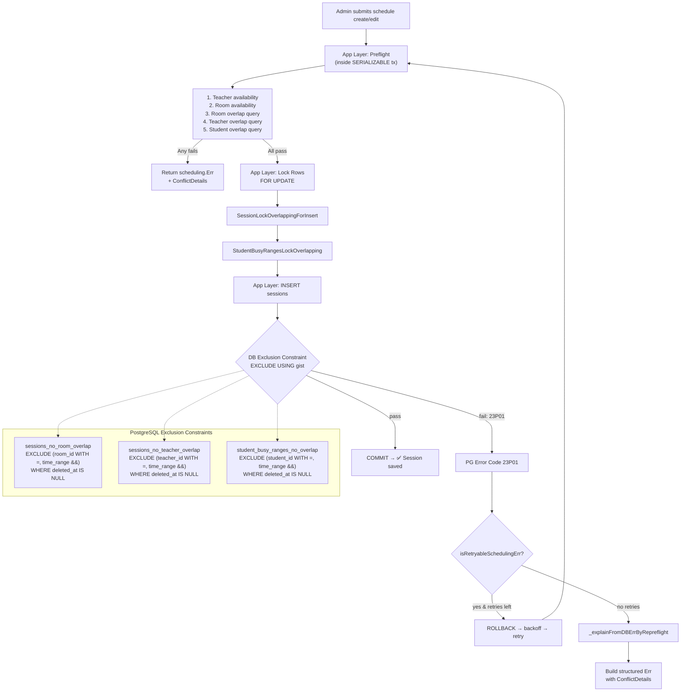
```mermaid
flowchart TD
    A["Admin submits schedule create/edit"] --> B["App Layer: Preflight<br/>(inside SERIALIZABLE tx)"]

    B --> C["1. Teacher availability<br/>2. Room availability<br/>3. Room overlap query<br/>4. Teacher overlap query<br/>5. Student overlap query"]

    C -- "Any fails" --> D["Return scheduling.Err<br/>+ ConflictDetails"]
    C -- "All pass" --> E["App Layer: Lock Rows<br/>FOR UPDATE"]

    E --> F["SessionLockOverlappingForInsert"]
    F --> G["StudentBusyRangesLockOverlapping"]

    G --> H["App Layer: INSERT sessions"]

    H --> I{"DB Exclusion Constraint<br/>EXCLUDE USING gist"}

    I -- "pass" --> J["COMMIT → ✅ Session saved"]

    I -- "fail: 23P01" --> K["PG Error Code 23P01"]

    K --> L{"isRetryableSchedulingErr?"}
    L -- "yes & retries left" --> M["ROLLBACK → backoff → retry"]
    M --> B
    L -- "no retries" --> N["_explainFromDBErrByRepreflight"]

    N --> O["Build structured Err<br/>with ConflictDetails"]

    subgraph constraints["PostgreSQL Exclusion Constraints"]
        C1["sessions_no_room_overlap<br/>EXCLUDE (room_id WITH =, time_range &&)<br/>WHERE deleted_at IS NULL"]
        C2["sessions_no_teacher_overlap<br/>EXCLUDE (teacher_id WITH =, time_range &&)<br/>WHERE deleted_at IS NULL"]
        C3["student_busy_ranges_no_overlap<br/>EXCLUDE (student_id WITH =, time_range &&)<br/>WHERE deleted_at IS NULL"]
    end

    I -.-> C1 & C2 & C3
```

**Findings:** Defense-in-depth with two independent enforcement layers (app preflight + DB exclusion constraints). Serializable isolation + retry loop resolves races (not just prevents them). DB rejection re-hydrates into same structured error shape as preflight rejection.

**Key files:** `db/migrations/00003_scheduling.sql:98-111` (GiST constraints), `scheduling/preflight.go:105-205`, `scheduling/service.go:1175-1201` (repreflight), `scheduling/service.go:1375-1381` (isRetryable), `db/invariants_integration_test.go:166-241`

---

### Diagram 10: Recurrence Model

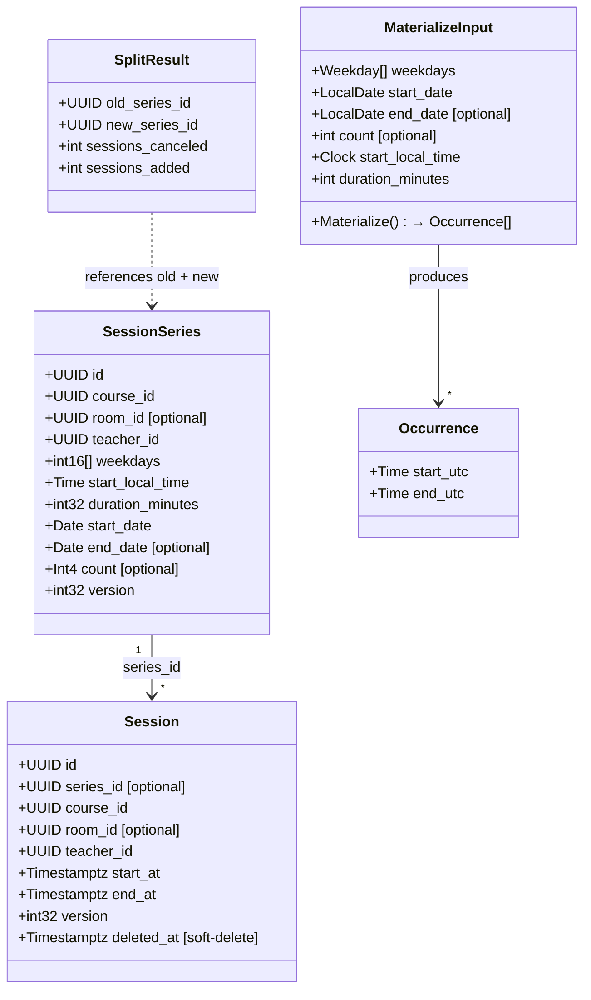
```mermaid
classDiagram
    class SessionSeries {
        +UUID id
        +UUID course_id
        +UUID room_id [optional]
        +UUID teacher_id
        +int16[] weekdays
        +Time start_local_time
        +int32 duration_minutes
        +Date start_date
        +Date end_date [optional]
        +Int4 count [optional]
        +int32 version
    }

    class Session {
        +UUID id
        +UUID series_id [optional]
        +UUID course_id
        +UUID room_id [optional]
        +UUID teacher_id
        +Timestamptz start_at
        +Timestamptz end_at
        +int32 version
        +Timestamptz deleted_at [soft-delete]
    }

    class MaterializeInput {
        +Weekday[] weekdays
        +LocalDate start_date
        +LocalDate end_date [optional]
        +int count [optional]
        +Clock start_local_time
        +int duration_minutes
        +Materialize() → Occurrence[]
    }

    class Occurrence {
        +Time start_utc
        +Time end_utc
    }

    class SplitResult {
        +UUID old_series_id
        +UUID new_series_id
        +int sessions_canceled
        +int sessions_added
    }

    SessionSeries "1" --> "*" Session : series_id
    MaterializeInput --> "*" Occurrence : produces
    SplitResult ..> SessionSeries : references old + new
```

**Findings:** Fully materialized — all occurrences stored as rows (no on-the-fly computation at query time). Split severs series into two independent rows (no parent/child pointer, no split record). Per-occurrence exceptions handled via soft-delete + direct edits (no separate exceptions table).

**Key files:** `series/materialize.go:36-110`, `series/service.go:78-200` (CreateSeriesAndMaterializeTx), `series/service.go:203-378` (SplitThisAndFutureTx), `series/materialize_test.go:8-51`

---

### Diagram 11: Availability Windows

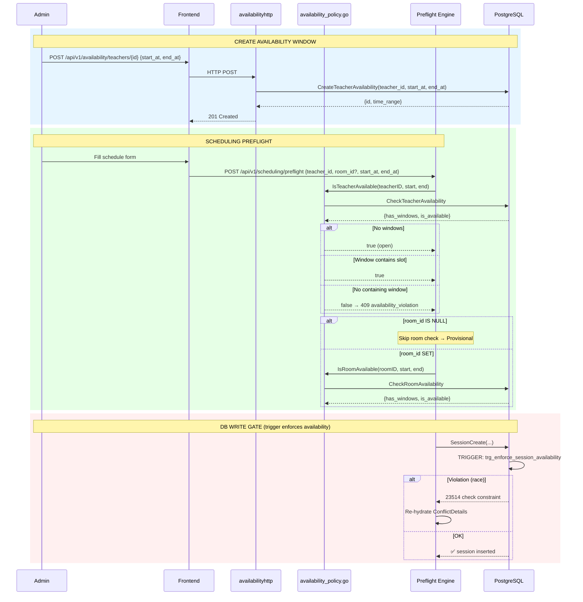
```mermaid
sequenceDiagram
    participant Admin as Admin
    participant FE as Frontend
    participant AH as availabilityhttp
    participant AP as availability_policy.go
    participant PF as Preflight Engine
    participant DB as PostgreSQL

    rect rgb(230,245,255)
        Note over Admin,DB: CREATE AVAILABILITY WINDOW
        Admin->>FE: POST /api/v1/availability/teachers/{id} {start_at, end_at}
        FE->>AH: HTTP POST
        AH->>DB: CreateTeacherAvailability(teacher_id, start_at, end_at)
        DB-->>AH: {id, time_range}
        AH-->>FE: 201 Created
    end

    rect rgb(230,255,230)
        Note over Admin,PF: SCHEDULING PREFLIGHT
        Admin->>FE: Fill schedule form
        FE->>PF: POST /api/v1/scheduling/preflight {teacher_id, room_id?, start_at, end_at}

        PF->>AP: IsTeacherAvailable(teacherID, start, end)
        AP->>DB: CheckTeacherAvailability
        DB-->>AP: {has_windows, is_available}
        alt No windows
            AP-->>PF: true (open)
        else Window contains slot
            AP-->>PF: true
        else No containing window
            AP-->>PF: false → 409 availability_violation
        end

        alt room_id IS NULL
            Note over PF: Skip room check → Provisional
        else room_id SET
            PF->>AP: IsRoomAvailable(roomID, start, end)
            AP->>DB: CheckRoomAvailability
            DB-->>AP: {has_windows, is_available}
        end
    end

    rect rgb(255,240,240)
        Note over Admin,DB: DB WRITE GATE (trigger enforces availability)
        PF->>DB: SessionCreate(...)
        DB->>DB: TRIGGER: trg_enforce_session_availability
        alt Violation (race)
            DB-->>PF: 23514 check constraint
            PF->>PF: Re-hydrate ConflictDetails
        else OK
            DB-->>PF: ✅ session inserted
        end
    end
```

**Findings:** Dual availability model — "default open" (no windows = open) vs "windows-enforced" (hard block). Hard-block enforced at two layers (Go + DB trigger). NULL room_id skips room availability entirely (enables Provisional scheduling semantics). All windows are flat timestamptz ranges (no separate weekly vs exception tables).

**Key files:** `availability_policy.go:10-53`, `availability.sql.go:15-74`, `db/migrations/00004_triggers.sql:5-63` (enforce trigger), `scheduling/preflight.go:105-135`, `availabilityhttp/routes.go:18-302`

---

## Part 3: Operations Domain

---

### Diagram 12: CRM Import Pipeline

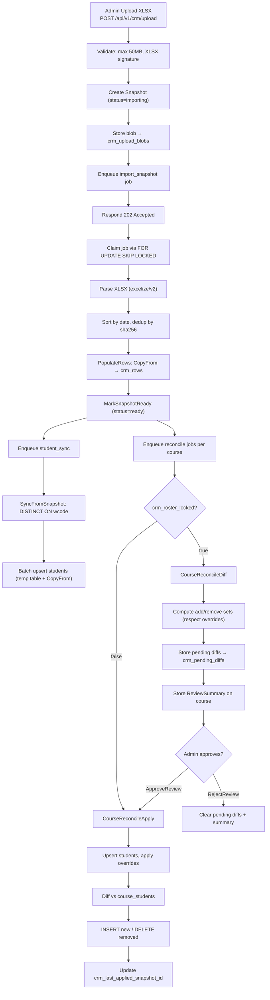
```mermaid
flowchart TD
    A["Admin Upload XLSX<br/>POST /api/v1/crm/upload"] --> B["Validate: max 50MB, XLSX signature"]
    B --> C["Create Snapshot (status=importing)"]
    C --> D["Store blob → crm_upload_blobs"]
    D --> E["Enqueue import_snapshot job"]
    E --> F["Respond 202 Accepted"]

    F --> G["Claim job via FOR UPDATE SKIP LOCKED"]
    G --> H["Parse XLSX (excelize/v2)"]
    H --> I["Sort by date, dedup by sha256"]
    I --> J["PopulateRows: CopyFrom → crm_rows"]
    J --> K["MarkSnapshotReady (status=ready)"]

    K --> L["Enqueue student_sync"]
    K --> M["Enqueue reconcile jobs per course"]

    L --> N["SyncFromSnapshot: DISTINCT ON wcode"]
    N --> O["Batch upsert students (temp table + CopyFrom)"]

    M --> P{"crm_roster_locked?"}
    P -- "false" --> Q["CourseReconcileApply"]
    P -- "true" --> R["CourseReconcileDiff"]

    Q --> S["Upsert students, apply overrides"]
    S --> T["Diff vs course_students"]
    T --> U["INSERT new / DELETE removed"]
    U --> V["Update crm_last_applied_snapshot_id"]

    R --> W["Compute add/remove sets (respect overrides)"]
    W --> X["Store pending diffs → crm_pending_diffs"]
    X --> Y["Store ReviewSummary on course"]

    Y --> Z{"Admin approves?"}
    Z -- "ApproveReview" --> Q
    Z -- "RejectReview" --> AA["Clear pending diffs + summary"]
```

**Findings:** Snapshot-anchored async pipeline with chain-enforced ordering (4 job types: import_snapshot → student_sync → course_reconcile). Two-mode reconciliation (locked=diff+review, unlocked=auto-apply). Optimistic concurrency on per-course filter version prevents stale applies.

**Key files:** `crmimport/upload_v2.go:37-91`, `crmimport/snapshot_service.go:31-149`, `crmimport/student_sync.go:33-135`, `crmimport/reconcile/reconcile.go:157-565`, `crmimport/queue/queue.go:88-198`

---

### Diagram 13: Absence Management

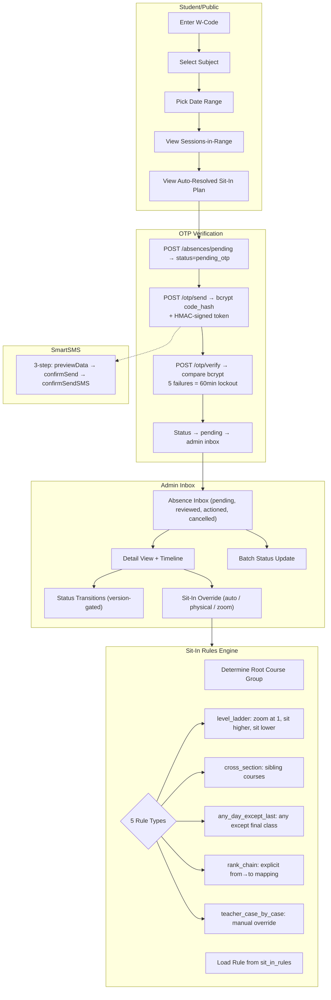
```mermaid
flowchart TB
    subgraph Student["Student/Public"]
        W["Enter W-Code"]
        SUBJ["Select Subject"]
        DR["Pick Date Range"]
        SESS["View Sessions-in-Range"]
        SITIN["View Auto-Resolved Sit-In Plan"]
    end

    subgraph OTPFlow["OTP Verification"]
        PENDING["POST /absences/pending → status=pending_otp"]
        SEND["POST /otp/send → bcrypt code_hash<br/>+ HMAC-signed token"]
        VERIFY["POST /otp/verify → compare bcrypt<br/>5 failures = 60min lockout"]
        VERIFIED["Status → pending → admin inbox"]
    end

    subgraph Admin["Admin Inbox"]
        INBOX["Absence Inbox (pending, reviewed, actioned, cancelled)"]
        DETAIL["Detail View + Timeline"]
        STATUS["Status Transitions (version-gated)"]
        OVERRIDE["Sit-In Override (auto / physical / zoom)"]
        BATCH["Batch Status Update"]
    end

    subgraph Resolver["Sit-In Rules Engine"]
        RCG["Determine Root Course Group"]
        RULE["Load Rule from sit_in_rules"]
        EVAL{"5 Rule Types"}
        EVAL --> LL["level_ladder: zoom at 1, sit higher, sit lower"]
        EVAL --> CS["cross_section: sibling courses"]
        EVAL --> AD["any_day_except_last: any except final class"]
        EVAL --> RC["rank_chain: explicit from→to mapping"]
        EVAL --> TC["teacher_case_by_case: manual override"]
    end

    subgraph SMS["SmartSMS"]
        FLOW["3-step: previewData → confirmSend → confirmSendSMS"]
    end

    W --> SUBJ --> DR --> SESS --> SITIN
    SITIN --> PENDING --> SEND --> VERIFY --> VERIFIED --> INBOX
    INBOX --> DETAIL --> STATUS
    DETAIL --> OVERRIDE
    INBOX --> BATCH
    OVERRIDE --> Resolver
    SEND -.-> FLOW
```

**Findings:** OTP is two-phase hybrid (bcrypt code_hash + HMAC-signed token). 5 distinct sit-in rule types with configurable JSON predicates. Three fallback regimes when auto-resolution fails (form-time, admin override, batch ops).

**Key files:** `absenceshttp/resolver.go:111-226`, `absenceshttp/rule_evaluator.go:56-253`, `absenceshttp/management_routes.go:340-908`, `db/absence_management_custom.go:69-553`, `smartsms/client.go:312-423`

---

### Diagram 14: Idempotency Flow

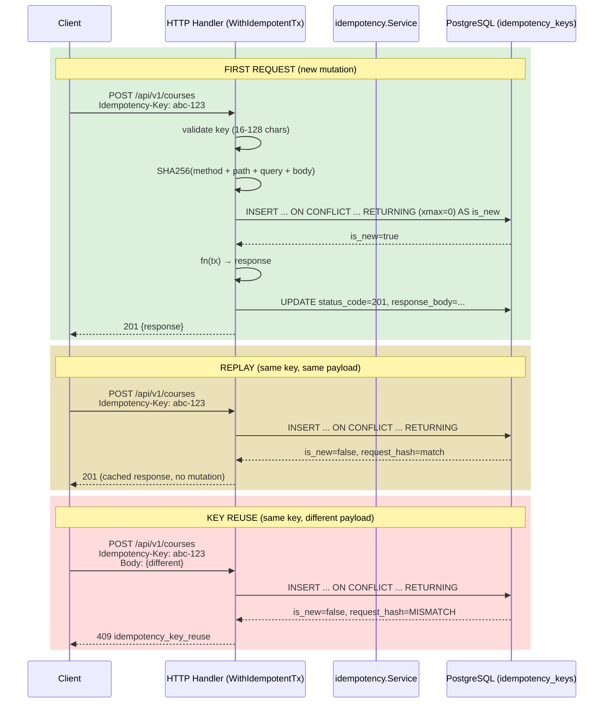
```mermaid
sequenceDiagram
    participant Client
    participant Handler as HTTP Handler (WithIdempotentTx)
    participant IDSvc as idempotency.Service
    participant DB as PostgreSQL (idempotency_keys)

    rect rgb(220,240,220)
        Note over Client,DB: FIRST REQUEST (new mutation)
        Client->>Handler: POST /api/v1/courses<br/>Idempotency-Key: abc-123
        Handler->>Handler: validate key (16-128 chars)
        Handler->>Handler: SHA256(method + path + query + body)
        Handler->>DB: INSERT ... ON CONFLICT ... RETURNING (xmax=0) AS is_new
        DB-->>Handler: is_new=true
        Handler->>Handler: fn(tx) → response
        Handler->>DB: UPDATE status_code=201, response_body=...
        Handler-->>Client: 201 {response}
    end

    rect rgb(235,225,185)
        Note over Client,DB: REPLAY (same key, same payload)
        Client->>Handler: POST /api/v1/courses<br/>Idempotency-Key: abc-123
        Handler->>DB: INSERT ... ON CONFLICT ... RETURNING
        DB-->>Handler: is_new=false, request_hash=match
        Handler-->>Client: 201 (cached response, no mutation)
    end

    rect rgb(255,220,220)
        Note over Client,DB: KEY REUSE (same key, different payload)
        Client->>Handler: POST /api/v1/courses<br/>Idempotency-Key: abc-123<br/>Body: {different}
        Handler->>DB: INSERT ... ON CONFLICT ... RETURNING
        DB-->>Handler: is_new=false, request_hash=MISMATCH
        Handler-->>Client: 409 idempotency_key_reuse
    end
```

**Findings:** INSERT...ON CONFLICT with `(xmax=0)` is the atomic gate (no race conditions). Request fingerprinting via SHA256 protects against accidental key reuse. Stale-record crash recovery (server crash between Acquire and Complete) returns 409 `stale_idempotency_record` — client generates fresh key.

**Key files:** `idempotency/idempotency.go:1-198`, `db/idempotency_custom.go:37-120`, `httpapi/httpadapter/adapter.go:218-314`, `docs/idempotency.md:1-121`

---

### Diagram 15: Concurrency Control

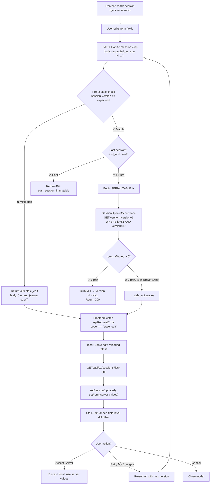
```mermaid
flowchart TD
    A["Frontend reads session (gets version=N)"] --> B["User edits form fields"]
    B --> C["PATCH /api/v1/sessions/{id}<br/>body: {expected_version: N, ...}"]

    C --> D{"Pre-tx stale check<br/>session.Version == expected?"}

    D -- "✅ Match" --> E{"Past session?<br/>end_at < now?"}
    D -- "❌ Mismatch" --> F["Return 409 stale_edit<br/>body: {current: {server copy}}"]

    E -- "✅ Future" --> G["Begin SERIALIZABLE tx"]
    E -- "❌ Past" --> H["Return 409 past_session_immutable"]

    G --> I["SessionUpdateOccurrence<br/>SET version=version+1<br/>WHERE id=$1 AND version=$7"]

    I --> J{"rows_affected > 0?"}

    J -- "✅ 1 row" --> K["COMMIT → version N→N+1<br/>Return 200"]
    J -- "❌ 0 rows (pgx.ErrNoRows)" --> L["→ stale_edit (race)"]

    F --> M["Frontend: catch ApiRequestError<br/>code === 'stale_edit'"]
    L --> M

    M --> N["Toast: 'Stale edit: reloaded latest'"]
    N --> O["GET /api/v1/sessions?ids={id}"]
    O --> P["setSession(updated), setForm(server values)"]

    P --> Q["StaleEditBanner: field-level diff table"]
    Q --> R{"User action?"}
    R -- "Accept Server" --> S["Discard local, use server values"]
    R -- "Retry My Changes" --> T["Re-submit with new version"]
    R -- "Cancel" --> U["Close modal"]
    T --> C
```

**Findings:** Two-tier stale detection (optimistic pre-tx check + DB WHERE clause final gate). 409 error contract includes stable `"stale_edit"` code + full server copy in `"current"` envelope. Frontend auto-recovery: reloads session, repopulates form, shows StaleEditBanner with field-level diff table and 3 actions.

**Key files:** `sessionshttp/routes.go:260-295,337-379`, `db/sessions.sql.go:413-424` (version WHERE), `useEditSession.ts:162-203`, `StaleEditBanner.tsx:1-83`, `series/service.go:208-209` (series version check)

---

### Diagram 16: Audit Logging

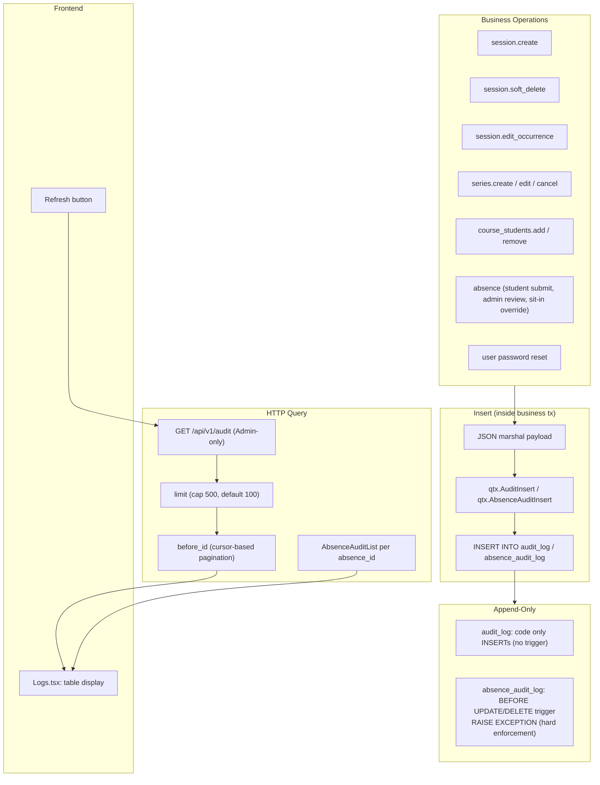
```mermaid
flowchart TD
    subgraph Ops["Business Operations"]
        A1["session.create"]
        A2["session.soft_delete"]
        A3["session.edit_occurrence"]
        A4["series.create / edit / cancel"]
        A5["course_students.add / remove"]
        A6["absence (student submit, admin review, sit-in override)"]
        A7["user password reset"]
    end

    subgraph Insert["Insert (inside business tx)"]
        B1["JSON marshal payload"]
        B2["qtx.AuditInsert / qtx.AbsenceAuditInsert"]
        B3["INSERT INTO audit_log / absence_audit_log"]
    end

    subgraph Append["Append-Only"]
        C1["audit_log: code only INSERTs (no trigger)"]
        C2["absence_audit_log: BEFORE UPDATE/DELETE trigger<br/>RAISE EXCEPTION (hard enforcement)"]
    end

    subgraph Query["HTTP Query"]
        D1["GET /api/v1/audit (Admin-only)"]
        D2["limit (cap 500, default 100)"]
        D3["before_id (cursor-based pagination)"]
        D4["AbsenceAuditList per absence_id"]
    end

    subgraph Frontend["Frontend"]
        E1["Logs.tsx: table display"]
        E2["Refresh button"]
    end

    Ops --> B1 --> B2 --> B3 --> Append
    D1 --> D2 --> D3 --> E1
    D4 --> E1
    E2 --> D1
```

**Findings:** Two-tier audit: general `audit_log` (no hard append-only trigger, relies on code) and `absence_audit_log` (trigger-enforced append-only). Best-effort inside business transactions (failure logged, operation succeeds). General audit only supports cursor-based pagination with no server-side filters; absence_audit queries per-entity.

**Key files:** `db/audit_custom.go:11-76`, `db/migrations/00021_absence_management.sql:24-51` (absence audit + append-only trigger), `audithttp/routes.go:19-70`, `sessionshttp/routes.go:239-245` (session audit), `Logs.tsx:1-82`

---

## Part 4: Frontend Layer

---

### Diagram 17: Frontend Data Flow

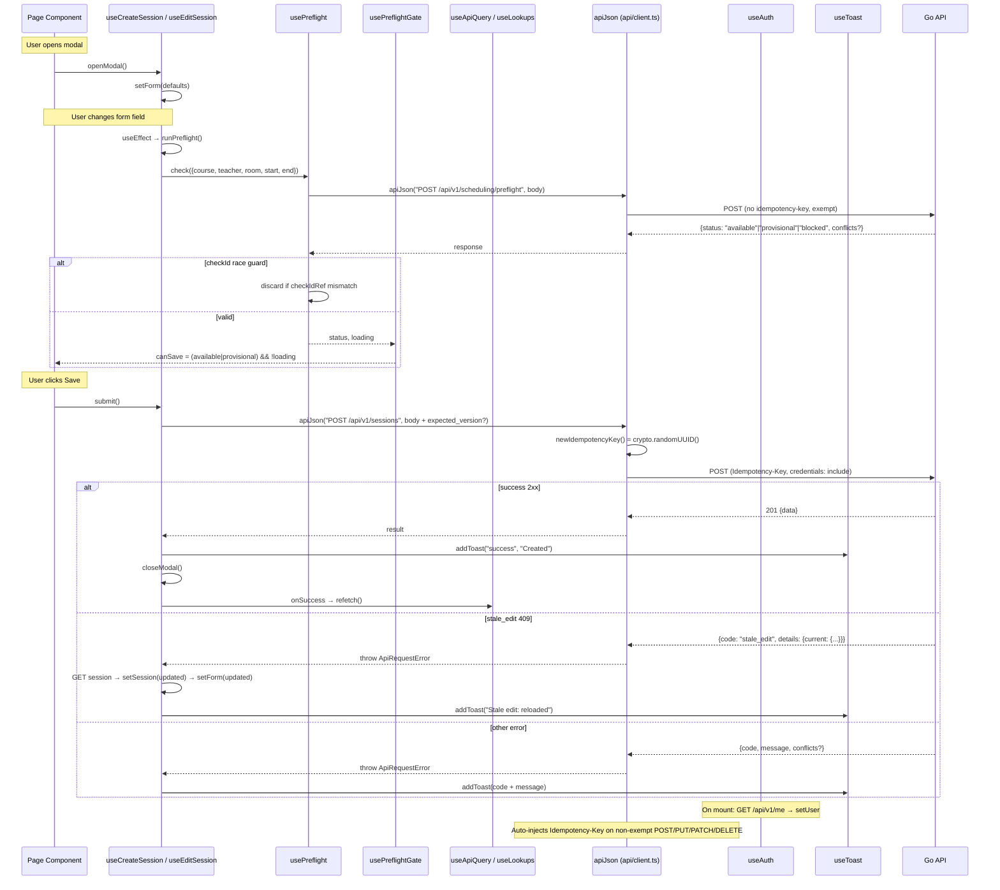
```mermaid
sequenceDiagram
    participant Page as Page Component
    participant SessionHook as useCreateSession / useEditSession
    participant Preflight as usePreflight
    participant Gate as usePreflightGate
    participant Cache as useApiQuery / useLookups
    participant Client as apiJson (api/client.ts)
    participant AuthCtx as useAuth
    participant ToastCtx as useToast
    participant BE as Go API

    Note over Page: User opens modal

    Page->>SessionHook: openModal()
    SessionHook->>SessionHook: setForm(defaults)

    Note over Page,SessionHook: User changes form field

    SessionHook->>SessionHook: useEffect → runPreflight()
    SessionHook->>Preflight: check({course, teacher, room, start, end})
    Preflight->>Client: apiJson("POST /api/v1/scheduling/preflight", body)
    Client->>BE: POST (no idempotency-key, exempt)
    BE-->>Client: {status: "available"|"provisional"|"blocked", conflicts?}
    Client-->>Preflight: response

    alt checkId race guard
        Preflight->>Preflight: discard if checkIdRef mismatch
    else valid
        Preflight-->>Gate: status, loading
        Gate-->>Page: canSave = (available|provisional) && !loading
    end

    Note over Page: User clicks Save

    Page->>SessionHook: submit()
    SessionHook->>Client: apiJson("POST /api/v1/sessions", body + expected_version?)

    Client->>Client: newIdempotencyKey() = crypto.randomUUID()
    Client->>BE: POST (Idempotency-Key, credentials: include)

    alt success 2xx
        BE-->>Client: 201 {data}
        Client-->>SessionHook: result
        SessionHook->>ToastCtx: addToast("success", "Created")
        SessionHook->>SessionHook: closeModal()
        SessionHook->>Cache: onSuccess → refetch()
    else stale_edit 409
        BE-->>Client: {code: "stale_edit", details: {current: {...}}}
        Client-->>SessionHook: throw ApiRequestError
        SessionHook->>SessionHook: GET session → setSession(updated) → setForm(updated)
        SessionHook->>ToastCtx: addToast("Stale edit: reloaded")
    else other error
        BE-->>Client: {code, message, conflicts?}
        Client-->>SessionHook: throw ApiRequestError
        SessionHook->>ToastCtx: addToast(code + message)
    end

    Note over AuthCtx: On mount: GET /api/v1/me → setUser
    Note over Client: Auto-injects Idempotency-Key on non-exempt POST/PUT/PATCH/DELETE
```

**Findings:** Preflight-as-gate pattern with race-safe cancellation (checkIdRef). Implicit idempotency (auto-injected Idempotency-Key). Minimal local-first state — no cross-component cache (each useApiQuery is per-component fetch wrapper). Structured ApiRequestError with code/status/details for error recovery.

**Key files:** `api/client.ts:119-144` (apiJson), `usePreflight.ts:41-148` (race-safe check), `useApiQuery.ts:11-62` (per-component fetch), `useCreateSession.ts:31-135`, `useEditSession.ts:36-219`

---

### Diagram 18: UI Component Library

```mermaid
mindmap
  root((Warwick Institute<br/>UI Component Library))
    UI Primitives
      Button (4 variants, 3 sizes, loading spinner)
      Input (forwardRef, error state)
      Select (inline chevron, placeholder)
      FormField (cloneElement for aria wiring)
      FormErrorSummary (role="alert" + clickable links)
      PageHeading
      LoadingSkeleton (table/card/text)
      EmptyState (icon + message + action)
      SearchInput (wraps Input)
      Tooltip (info icon, hover/focus)
    Overlays
      Modal (5 sizes, focus trap, escape, scroll lock)
      SlideOver (right panel, focus trap)
      ConfirmModal (danger/primary + loading)
    Form Controls
      TypeaheadSelect (searchable, keyboard nav, 20-cap)
      ActiveCourseSelector (subject-scoped popover)
      LevelStepper (+/- buttons, min clamp)
      DateRangeInput (maxDays enforcement)
    Scheduling Domain
      SessionOccurrenceForm (course + teacher + room + time)
      SeriesFormFields (weekday grid + recurrence config)
      ScheduleFilters (date range + view toggle + CTAs)
      SessionActions (contextual: one-off vs series)
      PreflightIndicator (conflict display + save gate)
      ProvisionalBadge (Student/Teacher/Room checklist)
      AttendancePanel (roster override table)
      ScheduleSessionCard (compact + auto-flip tooltip)
    Course Levels Domain
      LevelLadderCanvas (2D grid, empty states)
      LevelLadderCell (click/drop)
      RootCourseGroupRail (side nav)
      RootGroupManagerPanel (CRUD paginated)
      CourseAssignmentSheet (assign courses to groups)
      RuleSelector (grouped by type)
      RulePredicateForm (dynamic per rule type)
      RulePreviewPanel (tooltip labels)
      AutoSitInToggle
      ReturnsDeskPanel
    Absences Domain
      KanbanView (3-column: pending/reviewed/actioned)
      SessionChip (toggleable, alreadyAbsent state)
      SessionGrid (grid of chips)
      SitInResultCard
      ConfirmationSummary
    App Shell
      Layout (nav groups, mobile menu, absence badge poll 60s)
      WILogo (SVG + wordmark)
    Styling
      Tailwind v4 @theme tokens
      var(--color-wi-*) design tokens
      lucide-react icons (consistent)
      clsx + tailwind-merge (cn)
```

**Findings:** Clean 3-tier architecture (primitives → composites → domain wrappers). Consistent accessibility wiring via FormField (cloneElement for aria attributes). Design tokens centralized in `@theme` but inconsistently referenced — some components bypass token system with raw Tailwind classes.

**Key files:** `src/index.css:3-24` (theme tokens), `src/components/ui/FormField.tsx:1-48` (aria pattern), `src/components/Modal.tsx:1-102`, `src/components/TypeaheadSelect.tsx:1-152`, `src/components/PreflightIndicator.tsx:1-260`

---

### Diagram 19: Auth Flow

```mermaid
sequenceDiagram
    participant Admin as Admin Browser
    participant LoginUI as Login.tsx
    participant AuthCtx as useAuth (AuthProvider)
    participant GoAPI as Go API
    participant AuthSvc as auth.Service
    participant DB as PostgreSQL

    rect rgb(240,248,255)
        Note over Admin,DB: LOGIN
        Admin->>LoginUI: type username + password
        LoginUI->>AuthCtx: login(u, p)
        AuthCtx->>GoAPI: POST /api/v1/login {username, password}
        GoAPI->>AuthSvc: HandleLogin
        AuthSvc->>AuthSvc: rate limit IP (5/60s)
        AuthSvc->>AuthSvc: rate limit username (5/60s)
        AuthSvc->>DB: SELECT user WHERE username=$1
        alt user not found
            AuthSvc->>AuthSvc: HashPassword(pepper) [timing oracle burn]
            AuthSvc-->>GoAPI: ErrInvalidCredentials
        else found
            AuthSvc->>AuthSvc: verifyPassword (Argon2id + Blake2b pepper)
            alt wrong
                AuthSvc-->>GoAPI: ErrInvalidCredentials
            else correct
                AuthSvc->>DB: INSERT INTO auth_sessions
                AuthSvc->>Admin: Set-Cookie: __Host-warwick_session=<uuid>; HttpOnly; Secure; SameSite=Strict
                GoAPI-->>AuthCtx: {id, username, role}
                AuthCtx->>AuthCtx: setUser(user)
            end
        end
    end

    rect rgb(255,248,220)
        Note over Admin,DB: SESSION VALIDATION (every request)
        AuthCtx->>GoAPI: GET /api/v1/me
        AuthSvc->>Admin: read cookie
        AuthSvc->>DB: SELECT user JOIN auth_sessions
        AuthSvc->>AuthSvc: check deleted_at IS NULL
        AuthSvc->>AuthSvc: check revoked_at IS NULL
        AuthSvc->>AuthSvc: check expires_at > now (7d)
        AuthSvc->>AuthSvc: check last_seen_at within 8h (idle)
        AuthSvc->>AuthSvc: check password_version matches
        AuthSvc-->>Admin: 200 {user} or 401
    end

    rect rgb(235,255,235)
        Note over Admin,DB: PASSWORD RESET (Admin-only)
        Admin->>GoAPI: POST /api/v1/admin/users/{id}/reset_password
        GoAPI->>DB: Hash + store + bump password_version
        Note over DB: All existing sessions invalidated (password_version mismatch)
    end
```

**Findings:** Server-side sessions with DB round-trip per request (no JWT, no cache). Dual rate-limiting (per-IP + per-username, 5/60s) with timing oracle defense. MustAdmin as inline handler guard (not centralized middleware) — role enforcement is backend-only, per-endpoint.

**Key files:** `auth/service.go:143-293` (HandleLogin, RequireUser), `auth/service.go:103-132` (rate limiters), `httpapi/httpadapter/adapter.go:63-86` (MustUser/MustAdmin), `useAuth.tsx:1-70`, `corehttp/routes.go:18-62`

---

## Part 5: Infrastructure

---

### Diagram 20: Deployment & DevOps

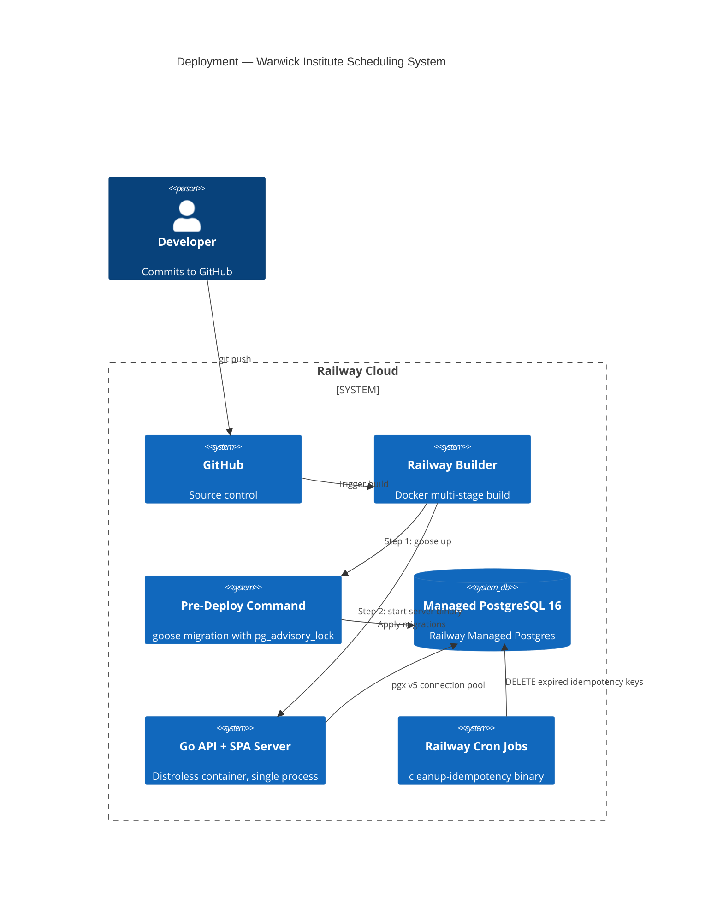
```mermaid
C4Context
  title Deployment — Warwick Institute Scheduling System

  Person(dev, "Developer", "Commits to GitHub")

  System_Boundary(railway, "Railway Cloud") {
    System(gh, "GitHub", "Source control")

    System(builder, "Railway Builder", "Docker multi-stage build")
    System(migrate, "Pre-Deploy Command", "goose migration with pg_advisory_lock")
    SystemDb(pg, "Managed PostgreSQL 16", "Railway Managed Postgres")
    System(api, "Go API + SPA Server", "Distroless container, single process")
    System(cron, "Railway Cron Jobs", "cleanup-idempotency binary")
  }

  Rel(dev, gh, "git push")
  Rel(gh, builder, "Trigger build")
  Rel(builder, migrate, "Step 1: goose up")
  Rel(builder, api, "Step 2: start server binary")
  Rel(migrate, pg, "Apply migrations")
  Rel(api, pg, "pgx v5 connection pool")
  Rel(cron, pg, "DELETE expired idempotency keys")

  UpdateLayoutConfig($c4ShapeInRow="3", $c4BoundaryInRow="1")
```

```
Dockerfile Build Stages:
  web-build (node:22-bookworm) → vite build → /app/dist
  go-build (golang:1.25) → CGO_ENABLED=0 static binary → server + migrate + cleanup-idempotency
  deploy (gcr.io/distroless/base-debian12:nonroot) → copy artifacts only

Runtime (single container):
  - Go API server on :8080
  - SPA served from STATIC_DIR (same origin)
  - CRM queue worker goroutine (in-process)
  - Railway Cron: cleanup-idempotency (periodic)
```

**Findings:** Multi-stage distroless build avoids all runtime OS dependencies. No background worker process — CRM queue worker runs as goroutine inside API server. Migrations serialized with PostgreSQL advisory locks in pre-deploy step. SPA bundled with `vite-plugin-singlefile` for minimal static footprint.

**Key files:** `Dockerfile:1-29` (multi-stage), `cmd/server/main.go:64-77` (queue worker init), `cmd/migrate/main.go:70-125` (advisory lock migration), `config/config.go:1-55`, `vite.config.ts:1-33`, `docker-compose.yml:1-20`

---

## Index: All 20 Perspectives

| # | Perspective | Diagram Type | Domain |
|---|---|---|---|
| 1 | System Context (C4 L1) | C4_Context | Architecture |
| 2 | Backend Go Module Graph | flowchart | Architecture |
| 3 | Frontend Page Tree | flowchart | Architecture |
| 4 | API Route Map | flowchart | Architecture |
| 5 | Database ERD | erDiagram | Architecture |
| 6 | Session Create Flow | sequenceDiagram | Scheduling |
| 7 | Session Edit/Cancel | sequenceDiagram | Scheduling |
| 8 | Preflight Engine | flowchart | Scheduling |
| 9 | Overlap Enforcement | flowchart | Scheduling |
| 10 | Recurrence Model | classDiagram | Scheduling |
| 11 | Availability Windows | sequenceDiagram | Scheduling |
| 12 | CRM Import Pipeline | flowchart | Operations |
| 13 | Absence Management | flowchart | Operations |
| 14 | Idempotency Flow | sequenceDiagram | Operations |
| 15 | Concurrency Control | flowchart | Operations |
| 16 | Audit Logging | flowchart | Operations |
| 17 | Frontend Data Flow | sequenceDiagram | Frontend |
| 18 | UI Component Library | mindmap | Frontend |
| 19 | Auth Flow | sequenceDiagram | Cross-cutting |
| 20 | Deployment & DevOps | C4_Context | Infrastructure |
